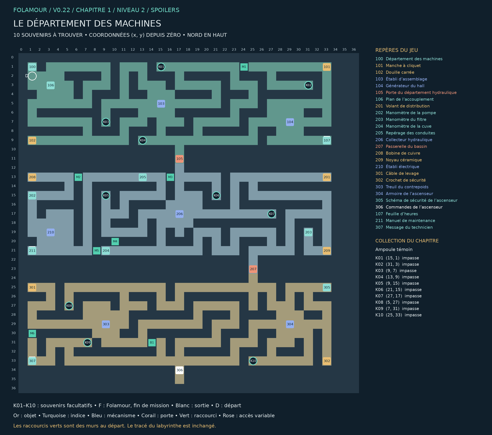

## Le département des machines

### Chapitre 1 / Niveau 2 • Version 0.22 • Solutions complètes

Explorez les départements, recoupez les indices et terminez les expériences de Folamour.

Cette édition remplace les anciennes cartes de ce niveau. Elle montre les nouveaux passages B1–B4, les portes existantes, les dix souvenirs K01–K10 et la position actuelle de Folamour. Les énigmes et les cases de base sont conservées.

### Collection et dossier

Collection : Ampoule témoin. Ramasser les dix souvenirs est facultatif. Le dossier compte les trouvailles par niveau et par chapitre ; une archive se révèle à 10, 25 et 50 trouvailles dans ce chapitre. Rien ne doit être dépensé ou remis à Folamour.

Une collection n’apparaît sur la carte du jeu qu’après découverte de sa case. Son cercle disparaît après ramassage. Le présent guide dévoile tous les emplacements. Le clic ou toucher permet de s’y rendre et de ramasser ; le bouton Ramasser et la touche E fonctionnent aussi.

La collection suit la sauvegarde de cette aventure. Dans le dossier, rejouer un niveau terminé conserve la collection et les bilans, mais recommence ses énigmes et remplace le niveau en cours après confirmation. Une nouvelle aventure remet le dossier à zéro.

## Plan exact du labyrinthe

Pour lire les petits repères, utiliser le PNG en pleine résolution ou le PDF A3 séparé. Les coordonnées désignent les cases du labyrinthe ; le nord est en haut.

## Les dix souvenirs

Les fonds de branches vides sont privilégiés, en donnant priorité aux branches longues. Lorsqu’il manque d’impasses adaptées, les autres objets sont dans des recoins éloignés des interactions. Aucun mur n’a été déplacé.

| Repère | Case (x, y) | Situation | Distance minimale aux repères |
| --- | --- | --- | --- |
| K01 | (15, 1) | Fond d’impasse ; branche de 2 pas | 16 pas |
| K02 | (31, 3) | Fond d’impasse ; branche de 6 pas | 12 pas |
| K03 | (9, 7) | Fond d’impasse ; branche de 4 pas | 8 pas |
| K04 | (13, 9) | Fond d’impasse ; branche de 2 pas | 6 pas |
| K05 | (9, 15) | Fond d’impasse ; branche de 2 pas | 14 pas |
| K06 | (21, 15) | Fond d’impasse ; branche de 6 pas | 8 pas |
| K07 | (27, 17) | Fond d’impasse ; branche de 4 pas | 10 pas |
| K08 | (5, 27) | Fond d’impasse ; branche de 8 pas | 14 pas |
| K09 | (7, 31) | Fond d’impasse ; branche de 2 pas | 8 pas |
| K10 | (25, 33) | Fond d’impasse ; branche de 2 pas | 8 pas |

Longueur de branche : du fond à la première jonction. Distance aux repères : chemin le plus court jusqu’à un objet, une interaction, un départ ou un élément de décor réservé, sur la grille et sans raccourci. Deux souvenirs sont séparés d’au moins huit pas et de quatre cases en distance Manhattan.

## Parcours et fin de mission

### Ordre de visite de référence :

100 → 106 → 101 → 102 → 103 → 104 → 208 → 201 → 205 → 202 → 203 → 204 → 206 → 209 → 210 → 301 → 305 → 302 → 303 → 304 → 306

Cet ordre comprend les indices et secrets. Les manipulations des postes figurent ci-dessous. Les souvenirs peuvent être ramassés lors des détours, dès que leur secteur est accessible. Aucun raccourci ni souvenir n’est requis pour terminer.

### Fin : 306 — Commandes de l’ascenseur — (17, 34)

Le point de sortie reste une vraie porte.

Validations requises : 304 — Armoire de l’ascenseur, 303 — Treuil du contrepoids

Les dix souvenirs n’entrent jamais dans ces conditions.

## Énigmes et manipulations

### 206 — Collecteur hydraulique

Régler les molettes selon les conduites et leurs manomètres.

Piste : Le nom de la molette n’est pas celui du manomètre : suivez les conduites.

Méthode : Le plan 205 relie RETOUR à CUVE, DÉPART à POMPE et PURGE à FILTRE.

Solution : Installez le volant 201. Réglez RETOUR sur 2, DÉPART sur 3 et PURGE sur 1, puis validez.

Code / réglage validé : 231

## Tous les repères et leurs conditions

### 100 — Département des machines — (1, 1)

L’ascenseur est immobilisé. Le générateur du hall, les circuits hydrauliques et le treuil doivent être remis en service. Les établis permettent d’assembler les pièces récupérées. Les manomètres portent les réglages du circuit.

« Nous avions un technicien. Vous avez deux mains. La différence est administrative. » — Folamour

### 101 — Manche à cliquet — (33, 1)

Une poignée robuste. Son logement carré est vide ; elle ne peut saisir aucun écrou en l’état.

### 102 — Douille carrée — (1, 9)

Une douille de grande taille, détachée de sa poignée. Le carré d’entraînement porte la même empreinte que celui d’un manche à cliquet.

### 103 — Établi d’assemblage — (15, 5)

Un étau, un axe de fixation et le dessin d’une clé à douille en deux parties. Le dessin montre un manche et une douille réunis par l’axe.

À installer / remettre : Manche à cliquet, Douille carrée

Produit : Clé à douille assemblée × 1

### 104 — Générateur du hall — (29, 7)

Le volant d’entraînement est grippé. Au centre, un écrou carré permet de le débloquer. Une commande de démarrage est reliée au verrou du département hydraulique.

À installer / remettre : Clé à douille assemblée

Ouvre : 105

### 105 — Porte du département hydraulique — (17, 11)

Une serrure électromagnétique, reliée au générateur du hall. Aucun clavier ni serrure manuelle.

Commande : 104

### 106 — Plan de l’accouplement — (3, 3)

Le croquis du générateur représente un écrou carré et une clé à douille. Une annotation indique : « Assemblage à l’étau avant mise en service. »

### 201 — Volant de distribution — (33, 13)

Un volant à trois branches. Une plaquette porte l’inscription : « Collecteur central — axe principal ». Il manque sur le collecteur du département hydraulique.

### 202 — Manomètre de la pompe — (1, 15)

POMPE — conduite rouge.
L’aiguille et les trois traits du cadran indiquent 3. Une gravure rappelle que les valeurs des cadrans sont les consignes de mise en service.

### 203 — Manomètre du filtre — (31, 19)

FILTRE — conduite turquoise.
L’aiguille est alignée sur le premier trait : 1.

### 204 — Manomètre de la cuve — (9, 21)

CUVE — conduite jaune.
L’aiguille est alignée sur le deuxième trait : 2.

### 205 — Repérage des conduites — (13, 13)

La gravure suit les trois conduites jusqu’au collecteur :
RETOUR ← CUVE
DÉPART ← POMPE
PURGE ← FILTRE

Les cadrans des machines fournissent les consignes. Les trois molettes du collecteur sont graduées de 0 à 3.

### 206 — Collecteur hydraulique — (17, 17)

Il manque le volant principal. Trois molettes commandent RETOUR, DÉPART et PURGE. Chaque conduite rejoint un manomètre dans le département.

À installer / remettre : Volant de distribution

Ouvre : 207

### 207 — Passerelle du bassin — (25, 23)

Une barrière interdit la passerelle tant que le bassin n’est pas vidangé. Sa commande dépend du collecteur hydraulique.

Commande : 206

### 208 — Bobine de cuivre — (1, 13)

Une bobine intacte pour un relais de puissance. Elle doit être montée autour d’un noyau isolant avant d’être utilisée.

### 209 — Noyau céramique — (33, 21)

Un noyau isolant. Sa forme et ses contacts correspondent au support d’un relais de puissance.

### 210 — Établi électrique — (3, 19)

Le gabarit de montage présente un noyau céramique entouré d’une bobine. Deux contacts attendent le relais ainsi formé.

À installer / remettre : Bobine de cuivre, Noyau céramique

Produit : Relais de puissance × 1

### 301 — Câble de levage — (1, 25)

Un câble neuf, dépourvu de crochet. Il est dimensionné pour le treuil du contrepoids.

### 302 — Crochet de sécurité — (33, 33)

Un crochet avec une goupille intacte. Il peut être fixé à un câble pour rattacher le contrepoids au treuil.

### 303 — Treuil du contrepoids — (9, 29)

Le contrepoids repose au sol. Le câble s’est rompu et son crochet a disparu. Le treuil dispose d’un support où assembler et tendre le remplacement.

À installer / remettre : Câble de levage, Crochet de sécurité

### 304 — Armoire de l’ascenseur — (29, 29)

Le logement du relais de puissance est vide. Le schéma représente une bobine entourant un noyau isolant. Les ateliers électriques se trouvent dans le département hydraulique.

À installer / remettre : Relais de puissance

### 305 — Schéma de sécurité de l’ascenseur — (33, 25)

Deux témoins sont reliés à la cabine : ALIMENTATION et CONTREPOIDS. Le départ est impossible tant que l’un des deux circuits est ouvert.

La passerelle reste praticable après vidange : les ateliers sont accessibles si une pièce a été oubliée.

### 306 — Commandes de l’ascenseur — (17, 34)

Le bouton de départ est relié à deux témoins de sécurité. L’ascenseur attend son alimentation et son contrepoids.

À valider d’abord : 304 — Armoire de l’ascenseur, 303 — Treuil du contrepoids

### 107 — Feuille d’heures — (33, 9)

« Temps passé à réparer le générateur : 4 heures. Temps passé à expliquer pourquoi il ne fallait pas y verser de café : 6 heures. » — Ancien technicien

Note secrète facultative. Elle est distincte de la collection K01–K10.

### 211 — Manuel de maintenance — (1, 21)

Page 1 : Ne rien forcer.
Page 2, manuscrite : Sauf si le docteur regarde.
Toutes les autres pages servent à caler une table.

Note secrète facultative. Elle est distincte de la collection K01–K10.

### 307 — Message du technicien — (1, 33)

« Si vous êtes parvenu jusqu’ici, vous savez déjà faire mon travail. Ne le dites surtout pas au docteur. Il vous proposera un stage. »

Note secrète facultative. Elle est distincte de la collection K01–K10.

## Raccourcis et reprise

| ID | Mur | Deux cases à visiter | Gain minimal |
| --- | --- | --- | --- |
| M1 | (24, 1) | (25, 1) / (23, 1) | 44 pas |
| M2 | (6, 13) | (7, 13) / (5, 13) | 24 pas |
| M3 | (16, 13) | (17, 13) / (15, 13) | 24 pas |
| M4 | (10, 20) | (10, 19) / (10, 21) | 14 pas |
| M5 | (8, 21) | (9, 21) / (7, 21) | 30 pas |
| M6 | (1, 30) | (1, 29) / (1, 31) | 36 pas |
| B1 | (14, 31) | (15, 31) / (13, 31) | 28 pas |

Marcher sur les deux côtés du mur ouvre le raccourci. Voir les cases sur la carte ne suffit pas. Le gain minimal compare les deux côtés du mur : passage de 2 pas contre le détour restant lorsque les autres raccourcis et les verrous sont ouverts. Les sas à sens unique restent exclus. Chaque nouvelle porte économise au moins 20 pas ; les portes antérieures au moins 12.

### Nouvelles portes : retours utiles

B1 : de [306] Commandes de l’ascenseur vers [303] Treuil du contrepoids. 33 pas sans cette porte ; 13 avec : 20 pas économisés.

Exemples mesurés avec la carte entièrement connue et les autres portes ouvertes. Ce sont des trajets de retour comparables, pas une estimation du temps d’une première partie. Le détour initial reste nécessaire pour visiter les deux côtés du mur.

Reprise de v0.21 : les anciennes portes et leur position sont conservées. Une nouvelle porte se révèle immédiatement si ses deux cases avaient déjà été parcourues. Les objets, énigmes et souvenirs restent acquis.

Le clic approche désormais assez près des commandes fixées au mur pour les examiner. Cliquer sur un objet inaccessible annule la destination précédente.

Carte : clic droit sur un passage découvert et accessible pour fermer la carte et marcher vers ce point. Zoom : molette ou boutons de zoom ; recul maximal augmenté. Dossier : bouton près de l’objectif, menu Pause ou bilan de fin.

Folamour réagit aux rencontres, découvertes, essais et réussites. Les options « Animations décoratives » et « Répliques de Folamour » sont séparées dans la pause. Désactiver les répliques n’efface pas les observations archivées.

Sauvegarde locale au navigateur et à l’appareil. Les anciennes sauvegardes v4 sont compatibles ; une collection déjà commencée est conservée. Les totaux des anciennes parties couvrent uniquement les informations qui ont été enregistrées. Aucun ancien souvenir n’est attribué automatiquement.
