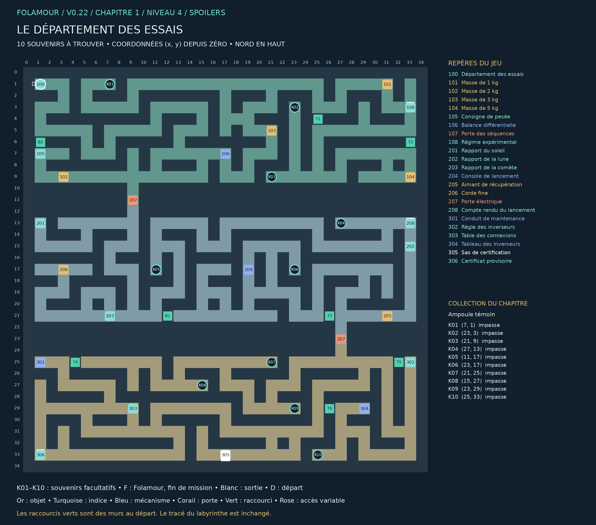

## Le département des essais

### Chapitre 1 / Niveau 4 • Version 0.22 • Solutions complètes

Explorez les départements, recoupez les indices et terminez les expériences de Folamour.

Cette édition remplace les anciennes cartes de ce niveau. Elle montre les nouveaux passages B1–B4, les portes existantes, les dix souvenirs K01–K10 et la position actuelle de Folamour. Les énigmes et les cases de base sont conservées.

### Collection et dossier

Collection : Ampoule témoin. Ramasser les dix souvenirs est facultatif. Le dossier compte les trouvailles par niveau et par chapitre ; une archive se révèle à 10, 25 et 50 trouvailles dans ce chapitre. Rien ne doit être dépensé ou remis à Folamour.

Une collection n’apparaît sur la carte du jeu qu’après découverte de sa case. Son cercle disparaît après ramassage. Le présent guide dévoile tous les emplacements. Le clic ou toucher permet de s’y rendre et de ramasser ; le bouton Ramasser et la touche E fonctionnent aussi.

La collection suit la sauvegarde de cette aventure. Dans le dossier, rejouer un niveau terminé conserve la collection et les bilans, mais recommence ses énigmes et remplace le niveau en cours après confirmation. Une nouvelle aventure remet le dossier à zéro.

## Plan exact du labyrinthe

Pour lire les petits repères, utiliser le PNG en pleine résolution ou le PDF A3 séparé. Les coordonnées désignent les cases du labyrinthe ; le nord est en haut.

## Les dix souvenirs

Les fonds de branches vides sont privilégiés, en donnant priorité aux branches longues. Lorsqu’il manque d’impasses adaptées, les autres objets sont dans des recoins éloignés des interactions. Aucun mur n’a été déplacé.

| Repère | Case (x, y) | Situation | Distance minimale aux repères |
| --- | --- | --- | --- |
| K01 | (7, 1) | Fond d’impasse ; branche de 18 pas | 26 pas |
| K02 | (23, 3) | Fond d’impasse ; branche de 6 pas | 20 pas |
| K03 | (21, 9) | Fond d’impasse ; branche de 2 pas | 16 pas |
| K04 | (27, 13) | Fond d’impasse ; branche de 4 pas | 6 pas |
| K05 | (11, 17) | Fond d’impasse ; branche de 2 pas | 16 pas |
| K06 | (23, 17) | Fond d’impasse ; branche de 4 pas | 8 pas |
| K07 | (21, 25) | Fond d’impasse ; branche de 4 pas | 24 pas |
| K08 | (15, 27) | Fond d’impasse ; branche de 2 pas | 28 pas |
| K09 | (23, 29) | Fond d’impasse ; branche de 2 pas | 14 pas |
| K10 | (25, 33) | Fond d’impasse ; branche de 4 pas | 8 pas |

Longueur de branche : du fond à la première jonction. Distance aux repères : chemin le plus court jusqu’à un objet, une interaction, un départ ou un élément de décor réservé, sur la grille et sans raccourci. Deux souvenirs sont séparés d’au moins huit pas et de quatre cases en distance Manhattan.

## Parcours et fin de mission

### Ordre de visite de référence :

100 → 101 → 102 → 103 → 104 → 105 → 108 → 106 → 201 → 202 → 203 → 205 → 206 → 208 → 204 → 301 → 302 → 303 → 306 → 304 → 305

Cet ordre comprend les indices et secrets. Les manipulations des postes figurent ci-dessous. Les souvenirs peuvent être ramassés lors des détours, dès que leur secteur est accessible. Aucun raccourci ni souvenir n’est requis pour terminer.

### Fin : 305 — Sas de certification — (17, 33)

Le point de sortie reste une vraie porte. Le seuil est fixé au mur sud.

Validations requises : 106 — Balance différentielle, 204 — Console de lancement, 304 — Tableau des inverseurs

Les dix souvenirs n’entrent jamais dans ces conditions.

## Énigmes et manipulations

### 106 — Balance différentielle

Les quatre masses manquent. Une fois installées, touchez chaque masse pour la déplacer : réserve, gauche, droite. La consigne 105 précise la répartition attendue.

Piste : On cherche une différence de masse, pas l’équilibre.

Méthode : Le total vaut 11 kg. Pour un écart de 1 kg, visez 6 kg à gauche et 5 kg à droite, avec deux masses par plateau.

Solution : Placez 1 et 5 kg à gauche, 2 et 3 kg à droite. Validez.

### 204 — Console de lancement

Reconstituez un ordre de cinq symboles avec les rapports 201, 202 et 203. Les boutons ajoutent un symbole à la suite. Vous pouvez retirer le dernier ou recommencer.

Piste : Placez d’abord les symboles dont la position est imposée.

Méthode : Le Soleil est troisième, la Comète dernière. Lune et Étoile doivent rester voisines dans cet ordre.

Solution : Effacez la suite, puis choisissez LUNE → ÉTOILE → SOLEIL → PLANÈTE → COMÈTE. Validez.

### 304 — Tableau des inverseurs

Installer le fusible de la console 204 et le contact du conduit 301. Actionnez ensuite les leviers pour allumer les cinq voyants. Les notes 302 et 303 décrivent le fonctionnement.

Piste : Un levier inverse ses voyants : il peut aussi éteindre un voyant déjà allumé.

Méthode : E dépend uniquement du levier IV. Les effets communs de deux leviers peuvent s’annuler.

Solution : Après installation du fusible et du contact, réinitialisez le circuit. Actionnez I, III et IV une fois chacun, puis validez.

## Tous les repères et leurs conditions

### 100 — Département des essais — (1, 1)

Trois essais vous attendent : répartition des masses, ordre de lancement et alimentation de secours. Les erreurs ne détruisent rien. Les mécanismes conservent vos réglages.
« Nous ne cherchons pas le meilleur sujet. Nous cherchons celui qui revient après avoir lu la consigne. » — Folamour

### 101 — Masse de 1 kg — (31, 1)

Une masse étalonnée de 1 kg. À installer dans la balance 106 ; son emplacement restera modifiable.

### 102 — Masse de 2 kg — (3, 9)

Une masse étalonnée de 2 kg. À installer dans la balance 106 ; son emplacement restera modifiable.

### 103 — Masse de 3 kg — (21, 5)

Une masse étalonnée de 3 kg. À installer dans la balance 106 ; son emplacement restera modifiable.

### 104 — Masse de 5 kg — (33, 9)

Une masse étalonnée de 5 kg. À installer dans la balance 106 ; son emplacement restera modifiable.

### 105 — Consigne de pesée — (1, 7)

Utiliser les quatre masses, exactement deux par plateau. Le plateau GAUCHE doit porter 1 kg de plus que le plateau DROIT. Une balance horizontale n’est donc pas la bonne réponse.

### 106 — Balance différentielle — (17, 7)

Les quatre masses manquent. Une fois installées, touchez chaque masse pour la déplacer : réserve, gauche, droite. La consigne 105 précise la répartition attendue.

À installer / remettre : Masse de 1 kg, Masse de 2 kg, Masse de 3 kg, Masse de 5 kg

Ouvre : 107

### 107 — Porte des séquences — (9, 11)

Le verrou dépend de la balance 106.

Commande : 106

### 108 — Régime expérimental — (33, 3)

« J’ai perdu deux kilos. Le laboratoire les a retrouvés dans le plateau de droite. » — Assistant du docteur

Note secrète facultative. Elle est distincte de la collection K01–K10.

### 201 — Rapport du soleil — (1, 13)

Le SOLEIL est toujours le troisième symbole du lancement. Chaque symbole est utilisé exactement une fois.

### 202 — Rapport de la lune — (33, 15)

La LUNE précède immédiatement l’ÉTOILE : rien ne peut se glisser entre les deux.

### 203 — Rapport de la comète — (7, 21)

La COMÈTE ferme la marche. La PLANÈTE arrive après le SOLEIL.

### 204 — Console de lancement — (19, 17)

Reconstituez un ordre de cinq symboles avec les rapports 201, 202 et 203. Les boutons ajoutent un symbole à la suite. Vous pouvez retirer le dernier ou recommencer.

Ouvre : 207

Produit : Fusible de sécurité × 1

### 205 — Aimant de récupération — (31, 21)

Un aimant puissant avec un anneau. Une corde permettrait de le descendre dans un conduit étroit.

### 206 — Corde fine — (3, 17)

Une corde de trois mètres, assez fine pour passer dans une grille. Elle peut se fixer à l’anneau d’un aimant.

### 207 — Porte électrique — (27, 23)

La console de lancement 204 commande ce verrou.

Commande : 204

### 208 — Compte rendu du lancement — (33, 13)

« Aucun départ réel n’a eu lieu. Nous avons toutefois facturé les frais de déplacement. »

Note secrète facultative. Elle est distincte de la collection K01–K10.

### 301 — Conduit de maintenance — (1, 25)

Un contact métallique brille sous la grille, hors de portée. Le passage est trop étroit pour une main. Un aimant suspendu à une corde pourrait le remonter.

À installer / remettre : Aimant de récupération, Corde fine

Produit : Contact métallique × 1

### 302 — Règle des inverseurs — (33, 25)

Chaque levier INVERSE tous ses voyants : allumé devient éteint, éteint devient allumé. Deux pressions sur le même levier s’annulent. Il faut allumer A, B, C, D et E. « Réinitialiser » restaure seulement le circuit, jamais les objets installés.

### 303 — Table des connexions — (9, 29)

Levier I : A + B
Levier II : B + C
Levier III : C + D
Levier IV : A + D + E

État initial : A et D allumés. Les autres sont éteints.

### 304 — Tableau des inverseurs — (29, 29)

Installer le fusible de la console 204 et le contact du conduit 301. Actionnez ensuite les leviers pour allumer les cinq voyants. Les notes 302 et 303 décrivent le fonctionnement.

À installer / remettre : Fusible de sécurité, Contact métallique

### 305 — Sas de certification — (17, 33)

Les trois essais doivent être validés : balance, séquence et circuit. Aucun code supplémentaire n’est demandé.

À valider d’abord : 106 — Balance différentielle, 204 — Console de lancement, 304 — Tableau des inverseurs

### 306 — Certificat provisoire — (1, 33)

« A réussi les essais sans détruire le matériel. Qualification : suspect. » — Folamour

Note secrète facultative. Elle est distincte de la collection K01–K10.

## Raccourcis et reprise

| ID | Mur | Deux cases à visiter | Gain minimal |
| --- | --- | --- | --- |
| T1 | (25, 4) | (25, 3) / (25, 5) | 20 pas |
| T2 | (33, 6) | (33, 5) / (33, 7) | 20 pas |
| T3 | (26, 21) | (27, 21) / (25, 21) | 12 pas |
| T4 | (4, 25) | (5, 25) / (3, 25) | 76 pas |
| T5 | (32, 25) | (33, 25) / (31, 25) | 12 pas |
| T6 | (26, 29) | (27, 29) / (25, 29) | 28 pas |
| B1 | (12, 21) | (13, 21) / (11, 21) | 72 pas |
| B2 | (1, 6) | (1, 5) / (1, 7) | 40 pas |

Marcher sur les deux côtés du mur ouvre le raccourci. Voir les cases sur la carte ne suffit pas. Le gain minimal compare les deux côtés du mur : passage de 2 pas contre le détour restant lorsque les autres raccourcis et les verrous sont ouverts. Les sas à sens unique restent exclus. Chaque nouvelle porte économise au moins 20 pas ; les portes antérieures au moins 12.

### Nouvelles portes : retours utiles

B1 : de [203] Rapport de la comète vers [204] Console de lancement. 72 pas sans cette porte ; 16 avec : 56 pas économisés.

B2 : de [100] Département des essais vers [204] Console de lancement. 70 pas sans cette porte ; 50 avec : 20 pas économisés.

Exemples mesurés avec la carte entièrement connue et les autres portes ouvertes. Ce sont des trajets de retour comparables, pas une estimation du temps d’une première partie. Le détour initial reste nécessaire pour visiter les deux côtés du mur.

Reprise de v0.21 : les anciennes portes et leur position sont conservées. Une nouvelle porte se révèle immédiatement si ses deux cases avaient déjà été parcourues. Les objets, énigmes et souvenirs restent acquis.

Le clic approche désormais assez près des commandes fixées au mur pour les examiner. Cliquer sur un objet inaccessible annule la destination précédente.

Carte : clic droit sur un passage découvert et accessible pour fermer la carte et marcher vers ce point. Zoom : molette ou boutons de zoom ; recul maximal augmenté. Dossier : bouton près de l’objectif, menu Pause ou bilan de fin.

Folamour réagit aux rencontres, découvertes, essais et réussites. Les options « Animations décoratives » et « Répliques de Folamour » sont séparées dans la pause. Désactiver les répliques n’efface pas les observations archivées.

Sauvegarde locale au navigateur et à l’appareil. Les anciennes sauvegardes v4 sont compatibles ; une collection déjà commencée est conservée. Les totaux des anciennes parties couvrent uniquement les informations qui ont été enregistrées. Aucun ancien souvenir n’est attribué automatiquement.
