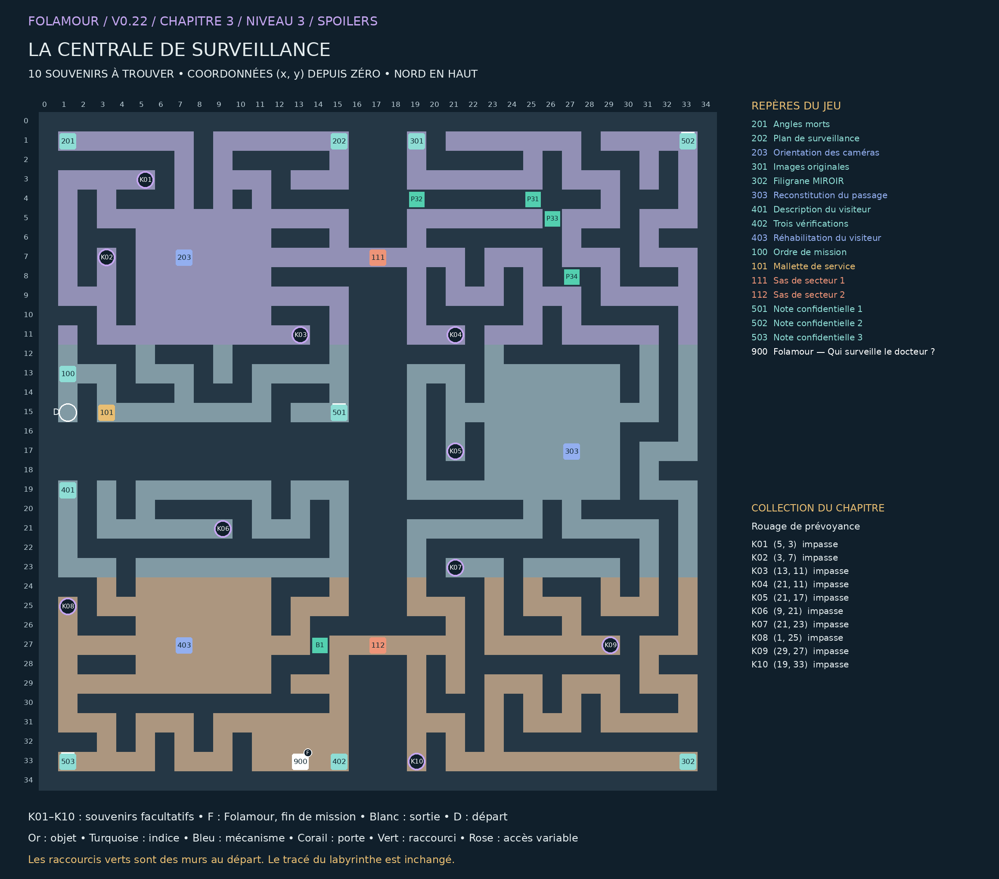

## La centrale de surveillance

### Chapitre 3 / Niveau 3 • Version 0.22 • Solutions complètes

« Quelqu’un circule sans autorisation dans mon laboratoire. Le système affirme qu’il porte ma blouse. Une provocation vestimentaire, manifestement. » — Folamour

Trois cours de surveillance entourent un vide central : optiques au nord-ouest, enregistrements à l’est, contrôle d’identité au sud-ouest. Les deux sas imposent un parcours autour du centre.

Cette édition remplace les anciennes cartes de ce niveau. Elle montre les nouveaux passages B1–B4, les portes existantes, les dix souvenirs K01–K10 et la position actuelle de Folamour. Les énigmes et les cases de base sont conservées.

### Collection et dossier

Collection : Rouage de prévoyance. Ramasser les dix souvenirs est facultatif. Le dossier compte les trouvailles par niveau et par chapitre ; une archive se révèle à 10, 25 et 50 trouvailles dans ce chapitre. Rien ne doit être dépensé ou remis à Folamour.

Une collection n’apparaît sur la carte du jeu qu’après découverte de sa case. Son cercle disparaît après ramassage. Le présent guide dévoile tous les emplacements. Le clic ou toucher permet de s’y rendre et de ramasser ; le bouton Ramasser et la touche E fonctionnent aussi.

La collection suit la sauvegarde de cette aventure. Dans le dossier, rejouer un niveau terminé conserve la collection et les bilans, mais recommence ses énigmes et remplace le niveau en cours après confirmation. Une nouvelle aventure remet le dossier à zéro.

## Plan exact du labyrinthe

Pour lire les petits repères, utiliser le PNG en pleine résolution ou le PDF A3 séparé. Les coordonnées désignent les cases du labyrinthe ; le nord est en haut.

## Les dix souvenirs

Les fonds de branches vides sont privilégiés, en donnant priorité aux branches longues. Lorsqu’il manque d’impasses adaptées, les autres objets sont dans des recoins éloignés des interactions. Aucun mur n’a été déplacé.

| Repère | Case (x, y) | Situation | Distance minimale aux repères |
| --- | --- | --- | --- |
| K01 | (5, 3) | Fond d’impasse ; branche de 2 pas | 10 pas |
| K02 | (3, 7) | Fond d’impasse ; branche de 2 pas | 12 pas |
| K03 | (13, 11) | Fond d’impasse ; branche de 2 pas | 10 pas |
| K04 | (21, 11) | Fond d’impasse ; branche de 6 pas | 8 pas |
| K05 | (21, 17) | Fond d’impasse ; branche de 2 pas | 10 pas |
| K06 | (9, 21) | Fond d’impasse ; branche de 4 pas | 36 pas |
| K07 | (21, 23) | Fond d’impasse ; branche de 10 pas | 36 pas |
| K08 | (1, 25) | Fond d’impasse ; branche de 2 pas | 8 pas |
| K09 | (29, 27) | Fond d’impasse ; branche de 2 pas | 28 pas |
| K10 | (19, 33) | Fond d’impasse ; branche de 2 pas | 8 pas |

Longueur de branche : du fond à la première jonction. Distance aux repères : chemin le plus court jusqu’à un objet, une interaction, un départ ou un élément de décor réservé, sur la grille et sans raccourci. Deux souvenirs sont séparés d’au moins huit pas et de quatre cases en distance Manhattan.

## Parcours et fin de mission

### Ordre de visite de référence :

100 → 101 → 501 → 202 → 201 → 203 → 302 → 502 → 301 → 303 → 402 → 503 → 401 → 403 → 900

Cet ordre comprend les indices et secrets. Les manipulations des postes figurent ci-dessous. Les souvenirs peuvent être ramassés lors des détours, dès que leur secteur est accessible. Aucun raccourci ni souvenir n’est requis pour terminer.

### Fin : 900 — Folamour — Qui surveille le docteur ? — (13, 33)

Parler au docteur et choisir « Faire le bilan avec Folamour ». Il remplace la dernière porte.

Validations requises : 203 — Orientation des caméras, 303 — Reconstitution du passage, 403 — Réhabilitation du visiteur

Les dix souvenirs n’entrent jamais dans ces conditions.

## Énigmes et manipulations

### 203 — Orientation des caméras

Tourner A, B et C. Le plan affiche les cases visibles et les points à couvrir. Tester la couverture avant validation.

Piste : Suivez les lignes des cibles à partir de chaque caméra.

Méthode : Les cibles des bureaux sont à droite de A ; celles des sas à gauche de B ; les registres au-dessus de C.

Solution : A EST ; B OUEST ; C NORD. Tester puis valider.

Depuis la réinitialisation : A EST ; B OUEST ; C NORD. Tester puis valider.

Les cibles des bureaux sont à droite de A ; celles des sas à gauche de B ; les registres au-dessus de C.

### 303 — Reconstitution du passage

Ajouter seulement les cinq vues physiques dans l’ordre. L’image synthétique doit rester hors du montage. Tester puis valider.

Piste : Vérifiez l’origine avant de regarder l’heure.

Méthode : Écartez E, marquée M. L’ordre du trajet et les heures des autres cartes doivent concorder.

Solution : A → C → F → D → B. Laisser E de côté. Tester puis valider.

Depuis la réinitialisation : A → C → F → D → B. Laisser E de côté. Tester puis valider.

Écartez E, marquée M. L’ordre du trajet et les heures des autres cartes doivent concorder.

### 403 — Réhabilitation du visiteur

Lire les trois relevés, comparer les quatre apparitions, puis choisir la personne correspondant à tous les indices. Valider pour rétablir son accès.

Piste : Le badge seul ne suffit pas : deux apparitions ont un statut invalide.

Méthode : Croisez humain physique, blouse et badge révoqué. La projection n’est pas un humain.

Solution : Lire Matière, Vêtement, Badge ; sélectionner Folamour puis valider.

Depuis la réinitialisation : Lire Matière, Vêtement, Badge ; sélectionner Folamour puis valider.

Croisez humain physique, blouse et badge révoqué. La projection n’est pas un humain.

## Tous les repères et leurs conditions

### 201 — Angles morts — (1, 1)

Orienter les trois caméras pour couvrir tous les points marqués *. Une caméra voit en ligne droite jusqu’au premier mur. La grille indique le nord en haut. Les trois appareils ont chacun une orientation indépendante.

### 202 — Plan de surveillance — (15, 1)

A se trouve à l’ouest de la ligne des bureaux, B à l’est de la ligne des sas, C au sud de la colonne des registres. Couvrir les points marqués suffit ; filmer un mur ne compte pas.

### 203 — Orientation des caméras — (7, 7)

Tourner A, B et C. Le plan affiche les cases visibles et les points à couvrir. Tester la couverture avant validation.

À installer / remettre : Mallette de service

Ouvre : 111

### 301 — Images originales — (19, 1)

Une personne passe par le vestibule, le couloir, l’atelier, le lecteur de badges puis la sortie. Le trajet ne revient jamais en arrière. Cinq vues physiques et une image de synthèse sont mélangées.

### 302 — Filigrane MIROIR — (33, 33)

Les images portant le filigrane M sont des reconstitutions, pas des preuves de passage. Écarter cette carte puis ordonner les cinq autres. Les heures affichées sur les cartes physiques viennent de la même horloge.

### 303 — Reconstitution du passage — (27, 17)

Ajouter seulement les cinq vues physiques dans l’ordre. L’image synthétique doit rester hors du montage. Tester puis valider.

À valider d’abord : 203 — Orientation des caméras

Ouvre : 112

### 401 — Description du visiteur — (1, 19)

Le visiteur est un humain physique en blouse, portant un badge révoqué. Il ne s’agit ni d’une projection ni du drone de maintenance. Le contrôle doit établir son identité, pas seulement repérer un badge invalide.

### 402 — Trois vérifications — (15, 33)

Consulter les trois relevés : matière, vêtement, statut du badge. Un humain en veste n’est pas la personne recherchée. Le propriétaire du laboratoire est soumis au même contrôle que les autres.

### 403 — Réhabilitation du visiteur — (7, 27)

Lire les trois relevés, comparer les quatre apparitions, puis choisir la personne correspondant à tous les indices. Valider pour rétablir son accès.

À valider d’abord : 303 — Reconstitution du passage

### 100 — Ordre de mission — (1, 13)

Trois cours de surveillance entourent un vide central : optiques au nord-ouest, enregistrements à l’est, contrôle d’identité au sud-ouest. Les deux sas imposent un parcours autour du centre.

### 101 — Mallette de service — (3, 15)

À installer au premier poste 203. Le matériel reste en place après les essais.

### 111 — Sas de secteur 1 — (17, 7)

Commande depuis le poste 203.

Commande : 203

### 112 — Sas de secteur 2 — (17, 27)

Commande depuis le poste 303.

Commande : 303

### 501 — Note confidentielle 1 — (15, 15)

Caméra 19 : chargée de surveiller les autres caméras lorsqu’elles regardent ailleurs.

Note secrète facultative. Elle est distincte de la collection K01–K10.

### 502 — Note confidentielle 2 — (33, 1)

Une chaise vide figure sur la liste des personnes à interroger. Elle refuse de coopérer.

Note secrète facultative. Elle est distincte de la collection K01–K10.

### 503 — Note confidentielle 3 — (1, 33)

Motif de révocation de Folamour : « Se comporte comme si tout lui appartenait. »

Note secrète facultative. Elle est distincte de la collection K01–K10.

### 900 — Folamour — Qui surveille le docteur ? — (13, 33)

« Après les trois vérifications, expliquez-moi qui circulait avec ma blouse. Je préfère que le système distingue les intrus de son employeur. »

À valider d’abord : 203 — Orientation des caméras, 303 — Reconstitution du passage, 403 — Réhabilitation du visiteur

## Raccourcis et reprise

| ID | Mur | Deux cases à visiter | Gain minimal |
| --- | --- | --- | --- |
| P31 | (25, 4) | (25, 3) / (25, 5) | 12 pas |
| P32 | (19, 4) | (19, 3) / (19, 5) | 12 pas |
| P33 | (26, 5) | (27, 5) / (25, 5) | 12 pas |
| P34 | (27, 8) | (27, 7) / (27, 9) | 24 pas |
| B1 | (14, 27) | (15, 27) / (13, 27) | 40 pas |

Marcher sur les deux côtés du mur ouvre le raccourci. Voir les cases sur la carte ne suffit pas. Le gain minimal compare les deux côtés du mur : passage de 2 pas contre le détour restant lorsque les autres raccourcis et les verrous sont ouverts. Les sas à sens unique restent exclus. Chaque nouvelle porte économise au moins 20 pas ; les portes antérieures au moins 12.

### Nouvelles portes : retours utiles

B1 : de [302] Filigrane MIROIR vers [403] Réhabilitation du visiteur. 60 pas sans cette porte ; 32 avec : 28 pas économisés.

Exemples mesurés avec la carte entièrement connue et les autres portes ouvertes. Ce sont des trajets de retour comparables, pas une estimation du temps d’une première partie. Le détour initial reste nécessaire pour visiter les deux côtés du mur.

Reprise de v0.21 : les anciennes portes et leur position sont conservées. Une nouvelle porte se révèle immédiatement si ses deux cases avaient déjà été parcourues. Les objets, énigmes et souvenirs restent acquis.

Le clic approche désormais assez près des commandes fixées au mur pour les examiner. Cliquer sur un objet inaccessible annule la destination précédente.

Carte : clic droit sur un passage découvert et accessible pour fermer la carte et marcher vers ce point. Zoom : molette ou boutons de zoom ; recul maximal augmenté. Dossier : bouton près de l’objectif, menu Pause ou bilan de fin.

Folamour réagit aux rencontres, découvertes, essais et réussites. Les options « Animations décoratives » et « Répliques de Folamour » sont séparées dans la pause. Désactiver les répliques n’efface pas les observations archivées.

Sauvegarde locale au navigateur et à l’appareil. Les anciennes sauvegardes v4 sont compatibles ; une collection déjà commencée est conservée. Les totaux des anciennes parties couvrent uniquement les informations qui ont été enregistrées. Aucun ancien souvenir n’est attribué automatiquement.
