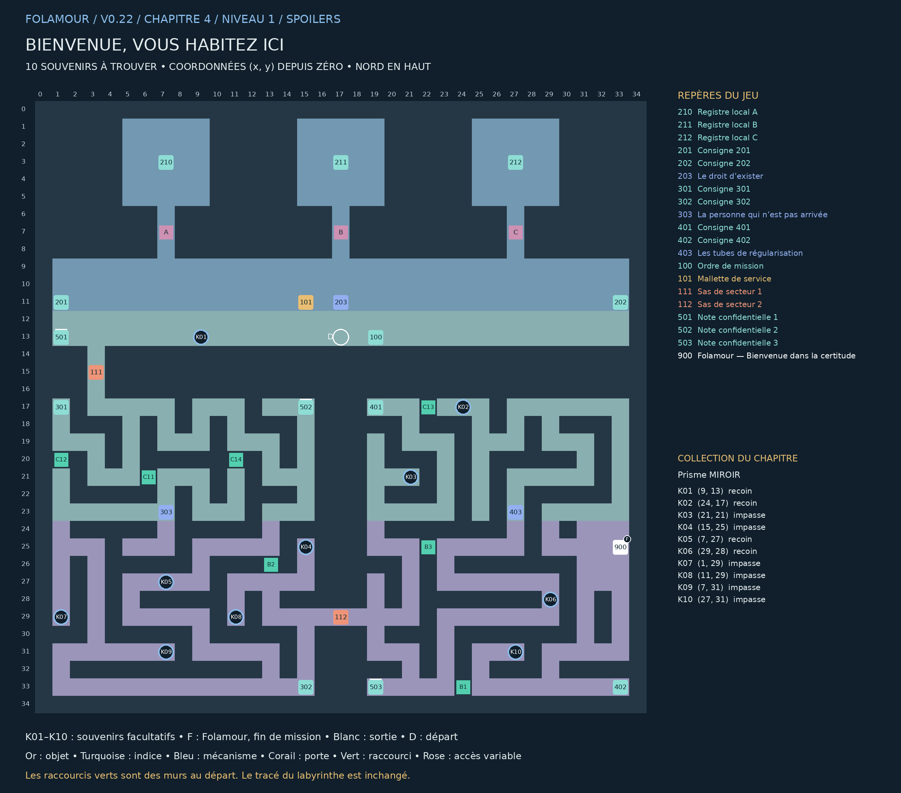

## Bienvenue, vous habitez ici

### Chapitre 4 / Niveau 1 • Version 0.22 • Solutions complètes

« Votre logement, votre emploi et vos opinions sont prêts. Votre arrivée, en revanche, n’a pas été autorisée. Veuillez démontrer votre présence. » — Folamour

Une gare en éventail : trois guichets au nord, un hall commun, puis deux labyrinthes de maintenance au sud. Les badges commandent les trois guichets ; le sas 111 mène aux dossiers et le sas 112 aux tubes.

Cette édition remplace les anciennes cartes de ce niveau. Elle montre les nouveaux passages B1–B4, les portes existantes, les dix souvenirs K01–K10 et la position actuelle de Folamour. Les énigmes et les cases de base sont conservées.

### Collection et dossier

Collection : Prisme MIROIR. Ramasser les dix souvenirs est facultatif. Le dossier compte les trouvailles par niveau et par chapitre ; une archive se révèle à 10, 25 et 50 trouvailles dans ce chapitre. Rien ne doit être dépensé ou remis à Folamour.

Une collection n’apparaît sur la carte du jeu qu’après découverte de sa case. Son cercle disparaît après ramassage. Le présent guide dévoile tous les emplacements. Le clic ou toucher permet de s’y rendre et de ramasser ; le bouton Ramasser et la touche E fonctionnent aussi.

La collection suit la sauvegarde de cette aventure. Dans le dossier, rejouer un niveau terminé conserve la collection et les bilans, mais recommence ses énigmes et remplace le niveau en cours après confirmation. Une nouvelle aventure remet le dossier à zéro.

## Plan exact du labyrinthe

Pour lire les petits repères, utiliser le PNG en pleine résolution ou le PDF A3 séparé. Les coordonnées désignent les cases du labyrinthe ; le nord est en haut.

## Les dix souvenirs

Les fonds de branches vides sont privilégiés, en donnant priorité aux branches longues. Lorsqu’il manque d’impasses adaptées, les autres objets sont dans des recoins éloignés des interactions. Aucun mur n’a été déplacé.

| Repère | Case (x, y) | Situation | Distance minimale aux repères |
| --- | --- | --- | --- |
| K01 | (9, 13) | Recoin dans un couloir calme | 8 pas |
| K02 | (24, 17) | Recoin dans un couloir calme | 21 pas |
| K03 | (21, 21) | Fond d’impasse ; branche de 2 pas | 16 pas |
| K04 | (15, 25) | Fond d’impasse ; branche de 4 pas | 10 pas |
| K05 | (7, 27) | Recoin dans un couloir calme | 18 pas |
| K06 | (29, 28) | Recoin dans un couloir calme | 15 pas |
| K07 | (1, 29) | Fond d’impasse ; branche de 4 pas | 12 pas |
| K08 | (11, 29) | Fond d’impasse ; branche de 4 pas | 10 pas |
| K09 | (7, 31) | Fond d’impasse ; branche de 4 pas | 20 pas |
| K10 | (27, 31) | Fond d’impasse ; branche de 8 pas | 12 pas |

Longueur de branche : du fond à la première jonction. Distance aux repères : chemin le plus court jusqu’à un objet, une interaction, un départ ou un élément de décor réservé, sur la grille et sans raccourci. Deux souvenirs sont séparés d’au moins huit pas et de quatre cases en distance Manhattan.

## Parcours et fin de mission

### Ordre de visite de référence :

100 → 101 → 201 → 501 → 202 → 203 → 210 → 203 → 211 → 203 → 212 → 203 → 301 → 502 → 302 → 303 → 503 → 401 → 402 → 403 → 900

Cet ordre comprend les indices et secrets. Les manipulations des postes figurent ci-dessous. Les souvenirs peuvent être ramassés lors des détours, dès que leur secteur est accessible. Aucun raccourci ni souvenir n’est requis pour terminer.

### Fin : 900 — Folamour — Bienvenue dans la certitude — (33, 25)

Parler au docteur et choisir « Faire le bilan avec Folamour ». Il remplace la dernière porte.

Validations requises : 203 — Le droit d’exister, 303 — La personne qui n’est pas arrivée, 403 — Les tubes de régularisation

Les dix souvenirs n’entrent jamais dans ces conditions.

## Énigmes et manipulations

### 203 — Le droit d’exister

Installer la mallette. Changer de badge ici, visiter chaque guichet, puis revenir. Lire A en résident, B en technicien et C en inspecteur ; certifier avec le badge inspecteur.

Piste : Recoupez les deux notes du secteur et observez le résultat de vos manipulations.

Méthode : Chaque badge donne un accès différent. Aucun ne suffit seul. Les trois lectures restent acquises quand vous changez de badge.

Solution : Depuis 203 : résident → lire 210 → retour ; technicien → lire 211 → retour ; inspecteur → lire 212 → retour. Choisir inspecteur et valider.

Depuis la réinitialisation : Depuis 203 : résident → lire 210 → retour ; technicien → lire 211 → retour ; inspecteur → lire 212 → retour. Choisir inspecteur et valider.

Chaque badge donne un accès différent. Aucun ne suffit seul. Les trois lectures restent acquises quand vous changez de badge.

### 303 — La personne qui n’est pas arrivée

Choisir le dossier, puis associer les trois preuves physiques : clé, quai, tampon. Un dossier anticipé ne prouve pas une arrivée.

Piste : Recoupez les deux notes du secteur et observez le résultat de vos manipulations.

Méthode : Le registre A impose triangle, B impose quai C, C impose ajourné. D est le seul dossier qui combine les trois.

Solution : Dossier D ; clé triangle ; quai C ; tampon ajourné. Valider.

Depuis la réinitialisation : Dossier D ; clé triangle ; quai C ; tampon ajourné. Valider.

Le registre A impose triangle, B impose quai C, C impose ajourné. D est le seul dossier qui combine les trois.

### 403 — Les tubes de régularisation

Régler A, B, C et D pour acheminer A → B → X et D → C → Y, avec les mêmes aiguillages. Le diagramme affiche les deux sorties possibles de chaque nœud. Tester puis valider.

Piste : Recoupez les deux notes du secteur et observez le résultat de vos manipulations.

Méthode : Fixer d’abord les arrivées : B doit viser X et C doit viser Y. A rejoint B ; D rejoint C.

Solution : A → B ; B → X ; C → Y ; D → C. Tester puis valider.

Depuis la réinitialisation : A → B ; B → X ; C → Y ; D → C. Tester puis valider.

Fixer d’abord les arrivées : B doit viser X et C doit viser Y. A rejoint B ; D rejoint C.

## Tous les repères et leurs conditions

### 210 — Registre local A — (7, 3)

A / Résident : le sujet 16 a une clé triangulaire. Aucune clé carrée ne lui appartient.

### 211 — Registre local B — (17, 3)

B / Technicien : le sujet 16 est arrivé par le quai C. Le lecteur garde la trace du badge, pas celle de la personne.

### 212 — Registre local C — (27, 3)

C / Inspecteur : le dossier valable a un tampon AJOURNÉ. Un dossier ANTICIPÉ décrit un événement qui n’a pas eu lieu.

### 201 — Consigne 201 — (1, 11)

Le terminal 203 change votre badge. Résident ouvre A ; technicien ouvre B ; inspecteur ouvre C. Un seul badge actif. Les autres portes se ferment.

### 202 — Consigne 202 — (33, 11)

Lire les trois registres 210, 211 et 212, puis revenir au 203 en inspecteur pour certifier la présence. Les changements se font uniquement près du terminal. Les registres lus restent dans le journal.

### 203 — Le droit d’exister — (17, 11)

Installer la mallette. Changer de badge ici, visiter chaque guichet, puis revenir. Lire A en résident, B en technicien et C en inspecteur ; certifier avec le badge inspecteur.

À installer / remettre : Mallette de service

Ouvre : 111

### 301 — Consigne 301 — (1, 17)

Les trois registres du hall décrivent votre dossier : forme de clé, quai et tampon. Les cinq dossiers du pupitre sont complets. Un seul respecte les trois constats ensemble.

### 302 — Consigne 302 — (15, 33)

A : triangle / B / ajourné. B : carré / C / ajourné. C : triangle / C / anticipé. D : triangle / C / ajourné. E : carré / B / anticipé.

### 303 — La personne qui n’est pas arrivée — (7, 23)

Choisir le dossier, puis associer les trois preuves physiques : clé, quai, tampon. Un dossier anticipé ne prouve pas une arrivée.

À valider d’abord : 203 — Le droit d’exister

Ouvre : 112

### 401 — Consigne 401 — (19, 17)

Deux capsules partent de A puis D. Les aiguillages conservent le même réglage pendant les deux trajets. La capsule de A doit visiter B puis arriver à X. Celle de D doit visiter C puis arriver à Y.

### 402 — Consigne 402 — (33, 33)

Chaque aiguillage a deux sorties indiquées sur le schéma. Une boucle est refusée. Tester montre les deux trajets complets ; changer un réglage efface la certification du test.

### 403 — Les tubes de régularisation — (27, 23)

Régler A, B, C et D pour acheminer A → B → X et D → C → Y, avec les mêmes aiguillages. Le diagramme affiche les deux sorties possibles de chaque nœud. Tester puis valider.

À valider d’abord : 303 — La personne qui n’est pas arrivée

### 100 — Ordre de mission — (19, 13)

Une gare en éventail : trois guichets au nord, un hall commun, puis deux labyrinthes de maintenance au sud. Les badges commandent les trois guichets ; le sas 111 mène aux dossiers et le sas 112 aux tubes.

### 101 — Mallette de service — (15, 11)

À installer au premier poste 203. Le matériel reste en place après les essais.

### 111 — Sas de secteur 1 — (3, 15)

Commande depuis le poste 203.

Commande : 203

### 112 — Sas de secteur 2 — (17, 29)

Commande depuis le poste 303.

Commande : 303

### 501 — Note confidentielle 1 — (1, 13)

Toute personne absente est priée de se présenter immédiatement.

Note secrète facultative. Elle est distincte de la collection K01–K10.

### 502 — Note confidentielle 2 — (15, 17)

Le logement de fonction est équipé d’une fenêtre donnant sur la prochaine fenêtre.

Note secrète facultative. Elle est distincte de la collection K01–K10.

### 503 — Note confidentielle 3 — (19, 33)

Votre recours a été accepté comme preuve de votre insatisfaction.

Note secrète facultative. Elle est distincte de la collection K01–K10.

### 900 — Folamour — Bienvenue dans la certitude — (33, 25)

« Terminez les trois contrôles de régularisation, puis revenez me parler. Ici, même les arrivées imprévues sont prévues par formulaire. »

À valider d’abord : 203 — Le droit d’exister, 303 — La personne qui n’est pas arrivée, 403 — Les tubes de régularisation

## Raccourcis et reprise

| ID | Mur | Deux cases à visiter | Gain minimal |
| --- | --- | --- | --- |
| C11 | (6, 21) | (7, 21) / (5, 21) | 16 pas |
| C12 | (1, 20) | (1, 19) / (1, 21) | 16 pas |
| C13 | (22, 17) | (23, 17) / (21, 17) | 44 pas |
| C14 | (11, 20) | (11, 19) / (11, 21) | 24 pas |
| B1 | (24, 33) | (25, 33) / (23, 33) | 60 pas |
| B2 | (13, 26) | (13, 25) / (13, 27) | 32 pas |
| B3 | (22, 25) | (23, 25) / (21, 25) | 32 pas |

Marcher sur les deux côtés du mur ouvre le raccourci. Voir les cases sur la carte ne suffit pas. Le gain minimal compare les deux côtés du mur : passage de 2 pas contre le détour restant lorsque les autres raccourcis et les verrous sont ouverts. Les sas à sens unique restent exclus. Chaque nouvelle porte économise au moins 20 pas ; les portes antérieures au moins 12.

### Nouvelles portes : retours utiles

B1 : de [402] Consigne 402 vers [303] La personne qui n’est pas arrivée. 88 pas sans cette porte ; 52 avec : 36 pas économisés.

B2 : de [502] Note confidentielle 2 vers [403] Les tubes de régularisation. 58 pas sans cette porte ; 34 avec : 24 pas économisés.

B3 : de [302] Consigne 302 vers [403] Les tubes de régularisation. 42 pas sans cette porte ; 22 avec : 20 pas économisés.

Exemples mesurés avec la carte entièrement connue et les autres portes ouvertes. Ce sont des trajets de retour comparables, pas une estimation du temps d’une première partie. Le détour initial reste nécessaire pour visiter les deux côtés du mur.

Reprise de v0.21 : les anciennes portes et leur position sont conservées. Une nouvelle porte se révèle immédiatement si ses deux cases avaient déjà été parcourues. Les objets, énigmes et souvenirs restent acquis.

Le clic approche désormais assez près des commandes fixées au mur pour les examiner. Cliquer sur un objet inaccessible annule la destination précédente.

Carte : clic droit sur un passage découvert et accessible pour fermer la carte et marcher vers ce point. Zoom : molette ou boutons de zoom ; recul maximal augmenté. Dossier : bouton près de l’objectif, menu Pause ou bilan de fin.

Folamour réagit aux rencontres, découvertes, essais et réussites. Les options « Animations décoratives » et « Répliques de Folamour » sont séparées dans la pause. Désactiver les répliques n’efface pas les observations archivées.

Sauvegarde locale au navigateur et à l’appareil. Les anciennes sauvegardes v4 sont compatibles ; une collection déjà commencée est conservée. Les totaux des anciennes parties couvrent uniquement les informations qui ont été enregistrées. Aucun ancien souvenir n’est attribué automatiquement.
