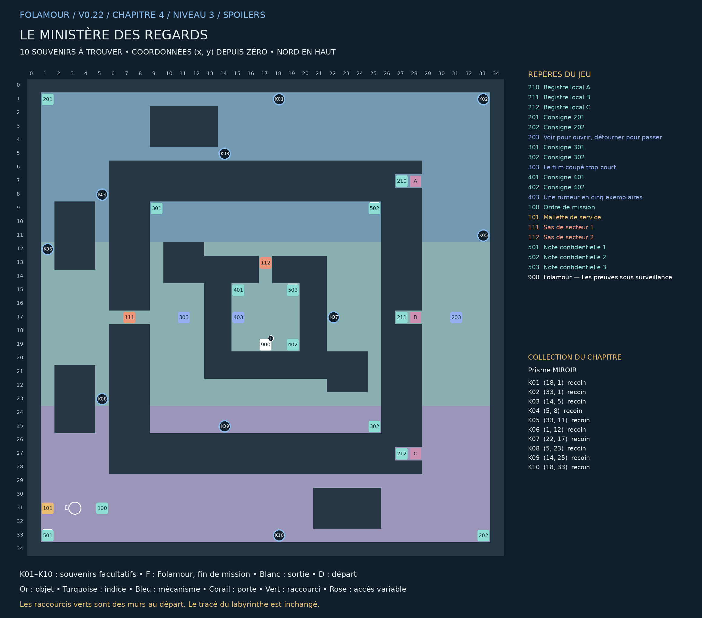

## Le ministère des regards

### Chapitre 4 / Niveau 3 • Version 0.22 • Solutions complètes

« Pour obtenir votre certificat de discrétion, veuillez réparer les appareils qui vous regardent. Ils sont momentanément occupés à s’observer entre eux. » — Folamour

Deux anneaux de surveillance entourent une tour centrale. Depuis l’anneau extérieur, trois niches à l’est se ferment selon les caméras. Un pont ouest mène aux montages ; une entrée nord mène aux sources.

Cette édition remplace les anciennes cartes de ce niveau. Elle montre les nouveaux passages B1–B4, les portes existantes, les dix souvenirs K01–K10 et la position actuelle de Folamour. Les énigmes et les cases de base sont conservées.

### Collection et dossier

Collection : Prisme MIROIR. Ramasser les dix souvenirs est facultatif. Le dossier compte les trouvailles par niveau et par chapitre ; une archive se révèle à 10, 25 et 50 trouvailles dans ce chapitre. Rien ne doit être dépensé ou remis à Folamour.

Une collection n’apparaît sur la carte du jeu qu’après découverte de sa case. Son cercle disparaît après ramassage. Le présent guide dévoile tous les emplacements. Le clic ou toucher permet de s’y rendre et de ramasser ; le bouton Ramasser et la touche E fonctionnent aussi.

La collection suit la sauvegarde de cette aventure. Dans le dossier, rejouer un niveau terminé conserve la collection et les bilans, mais recommence ses énigmes et remplace le niveau en cours après confirmation. Une nouvelle aventure remet le dossier à zéro.

## Plan exact du labyrinthe

Pour lire les petits repères, utiliser le PNG en pleine résolution ou le PDF A3 séparé. Les coordonnées désignent les cases du labyrinthe ; le nord est en haut.

## Les dix souvenirs

Les fonds de branches vides sont privilégiés, en donnant priorité aux branches longues. Lorsqu’il manque d’impasses adaptées, les autres objets sont dans des recoins éloignés des interactions. Aucun mur n’a été déplacé.

| Repère | Case (x, y) | Situation | Distance minimale aux repères |
| --- | --- | --- | --- |
| K01 | (18, 1) | Recoin dans un couloir calme | 17 pas |
| K02 | (33, 1) | Recoin dans un couloir calme | 11 pas |
| K03 | (14, 5) | Recoin dans un couloir calme | 17 pas |
| K04 | (5, 8) | Recoin dans un couloir calme | 11 pas |
| K05 | (33, 11) | Recoin dans un couloir calme | 8 pas |
| K06 | (1, 12) | Recoin dans un couloir calme | 11 pas |
| K07 | (22, 17) | Recoin dans un couloir calme | 11 pas |
| K08 | (5, 23) | Recoin dans un couloir calme | 8 pas |
| K09 | (14, 25) | Recoin dans un couloir calme | 11 pas |
| K10 | (18, 33) | Recoin dans un couloir calme | 15 pas |

Longueur de branche : du fond à la première jonction. Distance aux repères : chemin le plus court jusqu’à un objet, une interaction, un départ ou un élément de décor réservé, sur la grille et sans raccourci. Deux souvenirs sont séparés d’au moins huit pas et de quatre cases en distance Manhattan.

## Parcours et fin de mission

### Ordre de visite de référence :

100 → 101 → 501 → 201 → 202 → 203 → 210 → 203 → 211 → 203 → 212 → 203 → 301 → 502 → 302 → 303 → 401 → 503 → 402 → 403 → 900

Cet ordre comprend les indices et secrets. Les manipulations des postes figurent ci-dessous. Les souvenirs peuvent être ramassés lors des détours, dès que leur secteur est accessible. Aucun raccourci ni souvenir n’est requis pour terminer.

### Fin : 900 — Folamour — Les preuves sous surveillance — (17, 19)

Parler au docteur et choisir « Discuter des preuves avec Folamour ». Il remplace la dernière porte.

Validations requises : 203 — Voir pour ouvrir, détourner pour passer, 303 — Le film coupé trop court, 403 — Une rumeur en cinq exemplaires

Les dix souvenirs n’entrent jamais dans ces conditions.

## Énigmes et manipulations

### 203 — Voir pour ouvrir, détourner pour passer

Installer la mallette. A vers EST ouvre A ; B vers OUEST ferme B ; C vers NORD ouvre C. Régler les caméras, lire les trois niches physiques, puis valider avec tous les accès ouverts.

Piste : Recoupez les deux notes du secteur et observez le résultat de vos manipulations.

Méthode : La caméra B inverse la règle : il faut détourner son regard. Les directions nord, est et sud sont toutes valables pour B.

Solution : A EST ; B SUD (ou NORD/EST) ; C NORD. Visiter 210, 211 et 212. Retour au 203, tester puis valider.

Depuis la réinitialisation : A EST ; B SUD (ou NORD/EST) ; C NORD. Visiter 210, 211 et 212. Retour au 203, tester puis valider.

La caméra B inverse la règle : il faut détourner son regard. Les directions nord, est et sud sont toutes valables pour B.

### 303 — Le film coupé trop court

Assembler les cinq fragments en raccordant leurs états. Départ porte fermée, fin rue vide. Chaque fragment une fois. Tester montre les raccords, y compris un éventuel retour au chariot.

Piste : Recoupez les deux notes du secteur et observez le résultat de vos manipulations.

Méthode : B ouvre la porte, D fait entrer le chariot. Le détour A-C explique le nettoyage. E termine le film.

Solution : B → D → A → C → E. Tester puis valider.

Depuis la réinitialisation : B → D → A → C → E. Tester puis valider.

B ouvre la porte, D fait entrer le chariot. Le détour A-C explique le nettoyage. E termine le film.

### 403 — Une rumeur en cinq exemplaires

Remonter R1 → R2 → R3 → MIROIR et R5 → R4 → capteur. Classer chaque origine ultime et compter les familles physiques indépendantes.

Piste : Recoupez les deux notes du secteur et observez le résultat de vos manipulations.

Méthode : R1, R2 et R3 sont issus de MIROIR. R4 et R5 sont une seule famille mécanique. Le nombre de signatures ne compte pas.

Solution : R1-R3 : MIROIR ; R4-R5 : capteur ; familles physiques : 1. Valider.

Depuis la réinitialisation : R1-R3 : MIROIR ; R4-R5 : capteur ; familles physiques : 1. Valider.

R1, R2 et R3 sont issus de MIROIR. R4 et R5 sont une seule famille mécanique. Le nombre de signatures ne compte pas.

## Tous les repères et leurs conditions

### 210 — Registre local A — (27, 7)

A / La caméra archive le chariot à 09:10. Il transporte un balai. Aucun autre véhicule n’est visible.

### 211 — Registre local B — (27, 17)

B / Le poste B déclenche un verrou lorsqu’il regarde vers l’ouest. Son image montre une copie de l’écran A, pas une deuxième caméra.

### 212 — Registre local C — (27, 27)

C / La transmission mécanique confirme le passage du même chariot. La signature de MIROIR est ajoutée après la copie.

### 201 — Consigne 201 — (1, 1)

A ouvre la niche A en regardant EST. B ferme la niche B en regardant OUEST : toute autre direction la libère. C ouvre la niche C en regardant NORD.

### 202 — Consigne 202 — (33, 33)

Lire les trois registres 210-212 puis laisser les trois accès ouverts. Le panneau montre les orientations et l’état réel des portes. Les réglages se font au poste 203 seulement.

### 203 — Voir pour ouvrir, détourner pour passer — (31, 17)

Installer la mallette. A vers EST ouvre A ; B vers OUEST ferme B ; C vers NORD ouvre C. Régler les caméras, lire les trois niches physiques, puis valider avec tous les accès ouverts.

À installer / remettre : Mallette de service

Ouvre : 111

### 301 — Consigne 301 — (9, 9)

Chaque fragment montre le début et la fin d’une action. Relier la fin d’un fragment au début du suivant. Commencer PORTE FERMÉE, finir RUE VIDE. Utiliser chaque fragment une seule fois.

### 302 — Consigne 302 — (25, 25)

A : chariot → balai. B : porte fermée → porte ouverte. C : balai → chariot. D : porte ouverte → chariot. E : chariot → rue vide. Sortir trop tôt par E abandonne le nettoyage.

### 303 — Le film coupé trop court — (11, 17)

Assembler les cinq fragments en raccordant leurs états. Départ porte fermée, fin rue vide. Chaque fragment une fois. Tester montre les raccords, y compris un éventuel retour au chariot.

À valider d’abord : 203 — Voir pour ouvrir, détourner pour passer

Ouvre : 112

### 401 — Consigne 401 — (15, 15)

R1 cite R2. R2 cite R3. R3 cite MIROIR. R4 vient du capteur mécanique. R5 copie R4. Une copie conserve l’origine et ne crée jamais une mesure indépendante.

### 402 — Consigne 402 — (19, 19)

Attribuer à R1-R5 leur origine ultime. Puis annoncer combien de familles de mesures physiques indépendantes figurent dans ces cinq rapports. Une famille copiée compte une seule fois.

### 403 — Une rumeur en cinq exemplaires — (15, 17)

Remonter R1 → R2 → R3 → MIROIR et R5 → R4 → capteur. Classer chaque origine ultime et compter les familles physiques indépendantes.

À valider d’abord : 303 — Le film coupé trop court

### 100 — Ordre de mission — (5, 31)

Deux anneaux de surveillance entourent une tour centrale. Depuis l’anneau extérieur, trois niches à l’est se ferment selon les caméras. Un pont ouest mène aux montages ; une entrée nord mène aux sources.

### 101 — Mallette de service — (1, 31)

À installer au premier poste 203. Le matériel reste en place après les essais.

### 111 — Sas de secteur 1 — (7, 17)

Commande depuis le poste 203.

Commande : 203

### 112 — Sas de secteur 2 — (17, 13)

Commande depuis le poste 303.

Commande : 303

### 501 — Note confidentielle 1 — (1, 33)

Pour votre intimité, cette caméra est équipée d’un rideau dessiné.

Note secrète facultative. Elle est distincte de la collection K01–K10.

### 502 — Note confidentielle 2 — (25, 9)

Le service des angles morts refuse de communiquer son adresse.

Note secrète facultative. Elle est distincte de la collection K01–K10.

### 503 — Note confidentielle 3 — (19, 15)

Une caméra surveille le voyant indiquant qu’elle ne surveille personne.

Note secrète facultative. Elle est distincte de la collection K01–K10.

### 900 — Folamour — Les preuves sous surveillance — (17, 19)

« Après les trois contrôles, expliquez-moi ce que les images prouvent vraiment. Évitez simplement de les laisser témoigner toutes à la fois. »

À valider d’abord : 203 — Voir pour ouvrir, détourner pour passer, 303 — Le film coupé trop court, 403 — Une rumeur en cinq exemplaires

## Raccourcis et reprise

Ce niveau utilise des boucles naturelles et ne contient pas de raccourci caché.

Marcher sur les deux côtés du mur ouvre le raccourci. Voir les cases sur la carte ne suffit pas. Le gain minimal compare les deux côtés du mur : passage de 2 pas contre le détour restant lorsque les autres raccourcis et les verrous sont ouverts. Les sas à sens unique restent exclus. Chaque nouvelle porte économise au moins 20 pas ; les portes antérieures au moins 12.

Reprise de v0.21 : les anciennes portes et leur position sont conservées. Une nouvelle porte se révèle immédiatement si ses deux cases avaient déjà été parcourues. Les objets, énigmes et souvenirs restent acquis.

Le clic approche désormais assez près des commandes fixées au mur pour les examiner. Cliquer sur un objet inaccessible annule la destination précédente.

Carte : clic droit sur un passage découvert et accessible pour fermer la carte et marcher vers ce point. Zoom : molette ou boutons de zoom ; recul maximal augmenté. Dossier : bouton près de l’objectif, menu Pause ou bilan de fin.

Folamour réagit aux rencontres, découvertes, essais et réussites. Les options « Animations décoratives » et « Répliques de Folamour » sont séparées dans la pause. Désactiver les répliques n’efface pas les observations archivées.

Sauvegarde locale au navigateur et à l’appareil. Les anciennes sauvegardes v4 sont compatibles ; une collection déjà commencée est conservée. Les totaux des anciennes parties couvrent uniquement les informations qui ont été enregistrées. Aucun ancien souvenir n’est attribué automatiquement.
