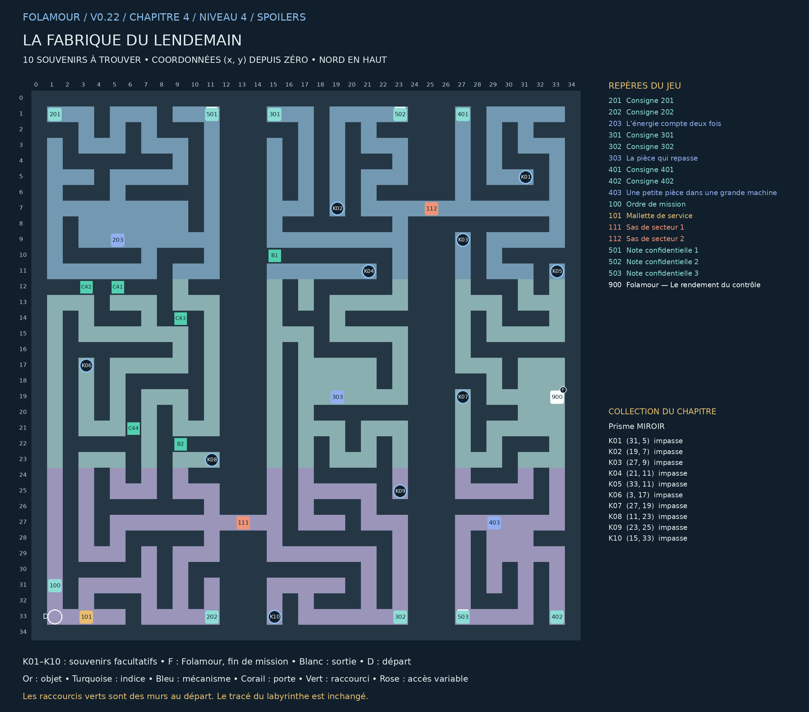

## La fabrique du lendemain

### Chapitre 4 / Niveau 4 • Version 0.22 • Solutions complètes

« Nous produisons aujourd’hui les solutions aux problèmes que nous annoncerons demain. Votre ascenseur est une commande mineure. Essayez de ne pas déranger les grandes. » — Folamour

Trois chaînes en tresses traversent le complexe : énergie à l’ouest, convoyeurs au centre, assemblage à l’est. Les passerelles changent de hauteur sur le plan ; les ateliers latéraux forment des boucles de retour.

Cette édition remplace les anciennes cartes de ce niveau. Elle montre les nouveaux passages B1–B4, les portes existantes, les dix souvenirs K01–K10 et la position actuelle de Folamour. Les énigmes et les cases de base sont conservées.

### Collection et dossier

Collection : Prisme MIROIR. Ramasser les dix souvenirs est facultatif. Le dossier compte les trouvailles par niveau et par chapitre ; une archive se révèle à 10, 25 et 50 trouvailles dans ce chapitre. Rien ne doit être dépensé ou remis à Folamour.

Une collection n’apparaît sur la carte du jeu qu’après découverte de sa case. Son cercle disparaît après ramassage. Le présent guide dévoile tous les emplacements. Le clic ou toucher permet de s’y rendre et de ramasser ; le bouton Ramasser et la touche E fonctionnent aussi.

La collection suit la sauvegarde de cette aventure. Dans le dossier, rejouer un niveau terminé conserve la collection et les bilans, mais recommence ses énigmes et remplace le niveau en cours après confirmation. Une nouvelle aventure remet le dossier à zéro.

## Plan exact du labyrinthe

Pour lire les petits repères, utiliser le PNG en pleine résolution ou le PDF A3 séparé. Les coordonnées désignent les cases du labyrinthe ; le nord est en haut.

## Les dix souvenirs

Les fonds de branches vides sont privilégiés, en donnant priorité aux branches longues. Lorsqu’il manque d’impasses adaptées, les autres objets sont dans des recoins éloignés des interactions. Aucun mur n’a été déplacé.

| Repère | Case (x, y) | Situation | Distance minimale aux repères |
| --- | --- | --- | --- |
| K01 | (31, 5) | Fond d’impasse ; branche de 8 pas | 24 pas |
| K02 | (19, 7) | Fond d’impasse ; branche de 8 pas | 10 pas |
| K03 | (27, 9) | Fond d’impasse ; branche de 4 pas | 16 pas |
| K04 | (21, 11) | Fond d’impasse ; branche de 4 pas | 18 pas |
| K05 | (33, 11) | Fond d’impasse ; branche de 2 pas | 24 pas |
| K06 | (3, 17) | Fond d’impasse ; branche de 18 pas | 44 pas |
| K07 | (27, 19) | Fond d’impasse ; branche de 4 pas | 14 pas |
| K08 | (11, 23) | Fond d’impasse ; branche de 8 pas | 10 pas |
| K09 | (23, 25) | Fond d’impasse ; branche de 14 pas | 18 pas |
| K10 | (15, 33) | Fond d’impasse ; branche de 4 pas | 12 pas |

Longueur de branche : du fond à la première jonction. Distance aux repères : chemin le plus court jusqu’à un objet, une interaction, un départ ou un élément de décor réservé, sur la grille et sans raccourci. Deux souvenirs sont séparés d’au moins huit pas et de quatre cases en distance Manhattan.

## Parcours et fin de mission

### Ordre de visite de référence :

100 → 101 → 202 → 501 → 201 → 203 → 302 → 502 → 301 → 303 → 401 → 402 → 503 → 403 → 900

Cet ordre comprend les indices et secrets. Les manipulations des postes figurent ci-dessous. Les souvenirs peuvent être ramassés lors des détours, dès que leur secteur est accessible. Aucun raccourci ni souvenir n’est requis pour terminer.

### Fin : 900 — Folamour — Le rendement du contrôle — (33, 19)

Parler au docteur et choisir « Faire le bilan avec Folamour ». Il remplace la dernière porte.

Validations requises : 203 — L’énergie compte deux fois, 303 — La pièce qui repasse, 403 — Une petite pièce dans une grande machine

Les dix souvenirs n’entrent jamais dans ces conditions.

## Énigmes et manipulations

### 203 — L’énergie compte deux fois

Répartir six unités entre A, B et C. Atteindre simultanément A+B=5, B+C=4 et A+C=3. Les jauges réagissent immédiatement.

Piste : Recoupez les deux notes du secteur et observez le résultat de vos manipulations.

Méthode : Comparer les sommes : A est une unité plus grand que C ; B est deux unités plus grand que C. Avec six unités, C=1, A=2, B=3.

Solution : A=2 ; B=3 ; C=1. Valider.

Depuis la réinitialisation : A=2 ; B=3 ; C=1. Valider.

Comparer les sommes : A est une unité plus grand que C ; B est deux unités plus grand que C. Avec six unités, C=1, A=2, B=3.

### 303 — La pièce qui repasse

Régler les trois aiguillages. Le trajet doit visiter M → R → C → S. Les sorties possibles et les stations apparaissent sur le schéma. Tester fournit une trace et la cause d’un refus.

Piste : Recoupez les deux notes du secteur et observez le résultat de vos manipulations.

Méthode : Le premier aiguillage doit entrer dans M. Le deuxième doit envoyer vers R. Le dernier rejoint C, qui mène à S. Les autres sorties recirculent ou sautent une opération.

Solution : Aiguillages 1=1 ; 2=0 ; 3=1. Tester : D → 1 → M → 2 → R → 3 → C → S. Valider.

Depuis la réinitialisation : Aiguillages 1=1 ; 2=0 ; 3=1. Tester : D → 1 → M → 2 → R → 3 → C → S. Valider.

Le premier aiguillage doit entrer dans M. Le deuxième doit envoyer vers R. Le dernier rejoint C, qui mène à S. Les autres sorties recirculent ou sautent une opération.

### 403 — Une petite pièce dans une grande machine

Programmer les six opérations selon les dépendances : socle avant moteur/guide ; moteur avant courroie ; guide et courroie avant capot ; capot avant contrôle. Tester puis valider.

Piste : Recoupez les deux notes du secteur et observez le résultat de vos manipulations.

Méthode : Le socle est premier, le contrôle dernier. Entre les deux, conserver les liens de dépendance ; plusieurs ordres intermédiaires sont acceptés.

Solution : Socle → moteur → guide → courroie → capot → contrôle. Tester puis valider. Guide et moteur peuvent être inversés.

Depuis la réinitialisation : Socle → moteur → guide → courroie → capot → contrôle. Tester puis valider. Guide et moteur peuvent être inversés.

Le socle est premier, le contrôle dernier. Entre les deux, conserver les liens de dépendance ; plusieurs ordres intermédiaires sont acceptés.

## Tous les repères et leurs conditions

### 201 — Consigne 201 — (1, 1)

Trois générateurs A, B, C distribuent six unités au total. La presse reçoit A+B et demande 5. Le refroidissement reçoit B+C et demande 4. Le guidage reçoit A+C et demande 3.

### 202 — Consigne 202 — (11, 33)

Une unité de générateur alimente deux postes par les circuits existants. Il ne faut pas additionner les besoins comme s’ils étaient indépendants. Les jauges affichent chaque somme.

### 203 — L’énergie compte deux fois — (5, 9)

Répartir six unités entre A, B et C. Atteindre simultanément A+B=5, B+C=4 et A+C=3. Les jauges réagissent immédiatement.

À installer / remettre : Mallette de service

Ouvre : 111

### 301 — Consigne 301 — (15, 1)

Le convoyeur part de D. À chaque case numérotée, l’aiguillage choisit sa sortie 0 ou 1. La pièce doit être moulée M, refroidie R, puis contrôlée C avant la sortie S.

### 302 — Consigne 302 — (23, 33)

Un passage à C avant R échoue ; R avant M échoue. La pièce peut repasser par un aiguillage, mais un circuit qui répète exactement le même état est une boucle. Les pièces d’essai sont toujours récupérées.

### 303 — La pièce qui repasse — (19, 19)

Régler les trois aiguillages. Le trajet doit visiter M → R → C → S. Les sorties possibles et les stations apparaissent sur le schéma. Tester fournit une trace et la cause d’un refus.

À valider d’abord : 203 — L’énergie compte deux fois

Ouvre : 112

### 401 — Consigne 401 — (27, 1)

Monter le socle avant le moteur et le guide. Le moteur doit précéder la courroie. Le guide doit précéder le capot. La courroie doit précéder le capot. Le contrôle clôt l’assemblage.

### 402 — Consigne 402 — (33, 33)

Le moteur et le guide peuvent être montés dans les deux ordres. Aucun ordre arbitraire n’est imposé si toutes les dépendances sont respectées. Tester indique la première dépendance manquante.

### 403 — Une petite pièce dans une grande machine — (29, 27)

Programmer les six opérations selon les dépendances : socle avant moteur/guide ; moteur avant courroie ; guide et courroie avant capot ; capot avant contrôle. Tester puis valider.

À valider d’abord : 303 — La pièce qui repasse

### 100 — Ordre de mission — (1, 31)

Trois chaînes en tresses traversent le complexe : énergie à l’ouest, convoyeurs au centre, assemblage à l’est. Les passerelles changent de hauteur sur le plan ; les ateliers latéraux forment des boucles de retour.

### 101 — Mallette de service — (3, 33)

À installer au premier poste 203. Le matériel reste en place après les essais.

### 111 — Sas de secteur 1 — (13, 27)

Commande depuis le poste 203.

Commande : 203

### 112 — Sas de secteur 2 — (25, 7)

Commande depuis le poste 303.

Commande : 303

### 501 — Note confidentielle 1 — (11, 1)

Commande : 1 pièce d’ascenseur. Emballage : 400 tonnes de matériel préventif.

Note secrète facultative. Elle est distincte de la collection K01–K10.

### 502 — Note confidentielle 2 — (23, 1)

Les capsules de tranquillité ne doivent jamais être secouées par le doute.

Note secrète facultative. Elle est distincte de la collection K01–K10.

### 503 — Note confidentielle 3 — (27, 33)

Objectif de production : suffisamment. Nouveau quota : davantage.

Note secrète facultative. Elle est distincte de la collection K01–K10.

### 900 — Folamour — Le rendement du contrôle — (33, 19)

« Faites valider les trois expériences, puis présentez votre bilan. Si la machine consomme son propre rendement, nous appellerons cela de l’autonomie. »

À valider d’abord : 203 — L’énergie compte deux fois, 303 — La pièce qui repasse, 403 — Une petite pièce dans une grande machine

## Raccourcis et reprise

| ID | Mur | Deux cases à visiter | Gain minimal |
| --- | --- | --- | --- |
| C41 | (5, 12) | (5, 11) / (5, 13) | 12 pas |
| C42 | (3, 12) | (3, 11) / (3, 13) | 12 pas |
| C43 | (9, 14) | (9, 13) / (9, 15) | 20 pas |
| C44 | (6, 21) | (7, 21) / (5, 21) | 28 pas |
| B1 | (15, 10) | (15, 9) / (15, 11) | 40 pas |
| B2 | (9, 22) | (9, 21) / (9, 23) | 36 pas |

Marcher sur les deux côtés du mur ouvre le raccourci. Voir les cases sur la carte ne suffit pas. Le gain minimal compare les deux côtés du mur : passage de 2 pas contre le détour restant lorsque les autres raccourcis et les verrous sont ouverts. Les sas à sens unique restent exclus. Chaque nouvelle porte économise au moins 20 pas ; les portes antérieures au moins 12.

### Nouvelles portes : retours utiles

B1 : de [301] Consigne 301 vers [203] L’énergie compte deux fois. 98 pas sans cette porte ; 66 avec : 32 pas économisés.

B2 : de [302] Consigne 302 vers [203] L’énergie compte deux fois. 70 pas sans cette porte ; 50 avec : 20 pas économisés.

Exemples mesurés avec la carte entièrement connue et les autres portes ouvertes. Ce sont des trajets de retour comparables, pas une estimation du temps d’une première partie. Le détour initial reste nécessaire pour visiter les deux côtés du mur.

Reprise de v0.21 : les anciennes portes et leur position sont conservées. Une nouvelle porte se révèle immédiatement si ses deux cases avaient déjà été parcourues. Les objets, énigmes et souvenirs restent acquis.

Le clic approche désormais assez près des commandes fixées au mur pour les examiner. Cliquer sur un objet inaccessible annule la destination précédente.

Carte : clic droit sur un passage découvert et accessible pour fermer la carte et marcher vers ce point. Zoom : molette ou boutons de zoom ; recul maximal augmenté. Dossier : bouton près de l’objectif, menu Pause ou bilan de fin.

Folamour réagit aux rencontres, découvertes, essais et réussites. Les options « Animations décoratives » et « Répliques de Folamour » sont séparées dans la pause. Désactiver les répliques n’efface pas les observations archivées.

Sauvegarde locale au navigateur et à l’appareil. Les anciennes sauvegardes v4 sont compatibles ; une collection déjà commencée est conservée. Les totaux des anciennes parties couvrent uniquement les informations qui ont été enregistrées. Aucun ancien souvenir n’est attribué automatiquement.
