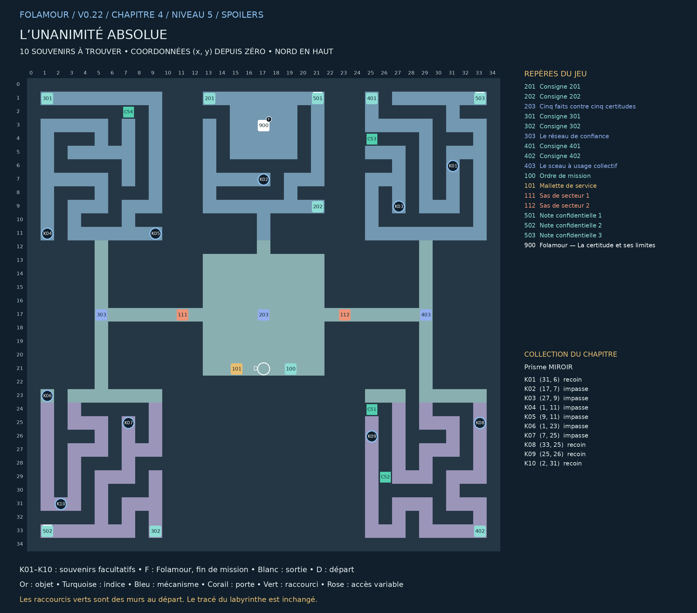

## L’unanimité absolue

### Chapitre 4 / Niveau 5 • Version 0.22 • Solutions complètes

« Nous sommes tous d’accord. Nous attendons simplement de savoir avec qui. » Cinq Folamour occupent cinq bureaux. Chaque signature attend les quatre autres.

Une salle de décision centrale dessert cinq bureaux : un au nord, deux à l’ouest et deux à l’est. Les couloirs latéraux contournent les bureaux, tandis que les deux sas gardent les réseaux du conseil.

Cette édition remplace les anciennes cartes de ce niveau. Elle montre les nouveaux passages B1–B4, les portes existantes, les dix souvenirs K01–K10 et la position actuelle de Folamour. Les énigmes et les cases de base sont conservées.

### Collection et dossier

Collection : Prisme MIROIR. Ramasser les dix souvenirs est facultatif. Le dossier compte les trouvailles par niveau et par chapitre ; une archive se révèle à 10, 25 et 50 trouvailles dans ce chapitre. Rien ne doit être dépensé ou remis à Folamour.

Une collection n’apparaît sur la carte du jeu qu’après découverte de sa case. Son cercle disparaît après ramassage. Le présent guide dévoile tous les emplacements. Le clic ou toucher permet de s’y rendre et de ramasser ; le bouton Ramasser et la touche E fonctionnent aussi.

La collection suit la sauvegarde de cette aventure. Dans le dossier, rejouer un niveau terminé conserve la collection et les bilans, mais recommence ses énigmes et remplace le niveau en cours après confirmation. Une nouvelle aventure remet le dossier à zéro.

## Plan exact du labyrinthe

Pour lire les petits repères, utiliser le PNG en pleine résolution ou le PDF A3 séparé. Les coordonnées désignent les cases du labyrinthe ; le nord est en haut.

## Les dix souvenirs

Les fonds de branches vides sont privilégiés, en donnant priorité aux branches longues. Lorsqu’il manque d’impasses adaptées, les autres objets sont dans des recoins éloignés des interactions. Aucun mur n’a été déplacé.

| Repère | Case (x, y) | Situation | Distance minimale aux repères |
| --- | --- | --- | --- |
| K01 | (31, 6) | Recoin dans un couloir calme | 9 pas |
| K02 | (17, 7) | Fond d’impasse ; branche de 4 pas | 14 pas |
| K03 | (27, 9) | Fond d’impasse ; branche de 2 pas | 18 pas |
| K04 | (1, 11) | Fond d’impasse ; branche de 4 pas | 14 pas |
| K05 | (9, 11) | Fond d’impasse ; branche de 2 pas | 10 pas |
| K06 | (1, 23) | Fond d’impasse ; branche de 24 pas | 30 pas |
| K07 | (7, 25) | Fond d’impasse ; branche de 2 pas | 6 pas |
| K08 | (33, 25) | Recoin dans un couloir calme | 12 pas |
| K09 | (25, 26) | Recoin dans un couloir calme | 19 pas |
| K10 | (2, 31) | Recoin dans un couloir calme | 21 pas |

Longueur de branche : du fond à la première jonction. Distance aux repères : chemin le plus court jusqu’à un objet, une interaction, un départ ou un élément de décor réservé, sur la grille et sans raccourci. Deux souvenirs sont séparés d’au moins huit pas et de quatre cases en distance Manhattan.

## Parcours et fin de mission

### Ordre de visite de référence :

100 → 101 → 202 → 501 → 201 → 203 → 301 → 502 → 302 → 303 → 402 → 503 → 401 → 403 → 900

Cet ordre comprend les indices et secrets. Les manipulations des postes figurent ci-dessous. Les souvenirs peuvent être ramassés lors des détours, dès que leur secteur est accessible. Aucun raccourci ni souvenir n’est requis pour terminer.

### Fin : 900 — Folamour — La certitude et ses limites — (17, 3)

Parler au docteur et choisir « Confronter le bilan avec Folamour ». Il remplace la dernière porte.

Validations requises : 203 — Cinq faits contre cinq certitudes, 303 — Le réseau de confiance, 403 — Le sceau à usage collectif

Les dix souvenirs n’entrent jamais dans ces conditions.

## Énigmes et manipulations

### 203 — Cinq faits contre cinq certitudes

Affecter une preuve à chaque bureau, sans doublon. Les copies ont été retirées ; les cinq originaux sont disponibles, même lors d’un accès direct à ce niveau.

Piste : Recoupez les deux notes du secteur et observez le résultat de vos manipulations.

Méthode : Sécurité reçoit film, industrie reçoit commande, transport reçoit ascenseur, météo reçoit pluviomètre. Le dossier d’arrivée reste pour habitat.

Solution : Habitat : dossier ; météo : pluviomètre ; sécurité : film ; industrie : commande ; transport : ascenseur. Valider.

Depuis la réinitialisation : Habitat : dossier ; météo : pluviomètre ; sécurité : film ; industrie : commande ; transport : ascenseur. Valider.

Sécurité reçoit film, industrie reçoit commande, transport reçoit ascenseur, météo reçoit pluviomètre. Le dossier d’arrivée reste pour habitat.

### 303 — Le réseau de confiance

Choisir une source pour chaque bureau. A et B doivent remonter à X ; C, D et E à Y. Tester trace toutes les chaînes et signale les boucles.

Piste : Recoupez les deux notes du secteur et observez le résultat de vos manipulations.

Méthode : A doit joindre X, B doit joindre A, C doit joindre Y. D ne peut passer par B (origine X) : il rejoint E, qui rejoint C.

Solution : A → X ; B → A ; C → Y ; D → E ; E → C. Tester puis valider.

Depuis la réinitialisation : A → X ; B → A ; C → Y ; D → E ; E → C. Tester puis valider.

A doit joindre X, B doit joindre A, C doit joindre Y. D ne peut passer par B (origine X) : il rejoint E, qui rejoint C.

### 403 — Le sceau à usage collectif

Sélectionner une ou deux copies du côté du sceau, puis Traverser. Coût = durée du plus lent : A1, B2, C5, D8. Tous au conseil en 15 unités maximum. Aucune limite en temps réel. Annulation et remise à zéro disponibles.

Piste : Recoupez les deux notes du secteur et observez le résultat de vos manipulations.

Méthode : Faire voyager C et D ensemble économise leurs longs trajets. A et B servent de passeurs du sceau. Le plus rapide ne doit pas faire tous les retours.

Solution : A+B aller (2), A retour (1), C+D aller (8), B retour (2), A+B aller (2). Total 15. Valider.

Depuis la réinitialisation : A+B aller (2), A retour (1), C+D aller (8), B retour (2), A+B aller (2). Total 15. Valider.

Faire voyager C et D ensemble économise leurs longs trajets. A et B servent de passeurs du sceau. Le plus rapide ne doit pas faire tous les retours.

## Tous les repères et leurs conditions

### 201 — Consigne 201 — (13, 1)

Cinq bureaux : habitat, météo, sécurité, industrie, transport. Affecter à chacun une preuve originale. Le dossier d’arrivée ne va ni à la météo ni à l’industrie. Le pluviomètre va au service qui annonce le temps.

### 202 — Consigne 202 — (21, 9)

Le film du chariot va à la sécurité. Le bon des coques va à l’industrie. Le test de l’ascenseur va au transport. Chaque preuve et chaque bureau sont utilisés une fois.

### 203 — Cinq faits contre cinq certitudes — (17, 17)

Affecter une preuve à chaque bureau, sans doublon. Les copies ont été retirées ; les cinq originaux sont disponibles, même lors d’un accès direct à ce niveau.

À installer / remettre : Mallette de service

Ouvre : 111

### 301 — Consigne 301 — (1, 1)

A peut croire B ou le capteur X. B peut croire C ou A. C peut croire A ou le capteur Y. D peut croire E ou B. E peut croire D ou C. X et Y sont les seuls constats physiques.

### 302 — Consigne 302 — (9, 33)

A et B doivent finir sur X ; C, D et E doivent finir sur Y. Aucune boucle n’est recevable. Une chaîne de copies aboutissant au bon capteur est recevable, mais ne multiplie pas les preuves.

### 303 — Le réseau de confiance — (5, 17)

Choisir une source pour chaque bureau. A et B doivent remonter à X ; C, D et E à Y. Tester trace toutes les chaînes et signale les boucles.

À valider d’abord : 203 — Cinq faits contre cinq certitudes

Ouvre : 112

### 401 — Consigne 401 — (25, 1)

Quatre copies portent leurs dossiers au cinquième Folamour par une passerelle. Durées : A=1, B=2, C=5, D=8 unités. Au plus deux copies traversent ensemble. Le sceau unique doit accompagner chaque traversée et chaque retour.

### 402 — Consigne 402 — (33, 33)

Une traversée coûte la durée du plus lent. Tout le monde part côté bureaux. Amener les quatre copies et le sceau au conseil en 15 unités maximum. Le temps avance uniquement quand vous appuyez sur Traverser. Annuler restitue le temps.

### 403 — Le sceau à usage collectif — (29, 17)

Sélectionner une ou deux copies du côté du sceau, puis Traverser. Coût = durée du plus lent : A1, B2, C5, D8. Tous au conseil en 15 unités maximum. Aucune limite en temps réel. Annulation et remise à zéro disponibles.

À valider d’abord : 303 — Le réseau de confiance

### 100 — Ordre de mission — (19, 21)

Une salle de décision centrale dessert cinq bureaux : un au nord, deux à l’ouest et deux à l’est. Les couloirs latéraux contournent les bureaux, tandis que les deux sas gardent les réseaux du conseil.

### 101 — Mallette de service — (15, 21)

À installer au premier poste 203. Le matériel reste en place après les essais.

### 111 — Sas de secteur 1 — (11, 17)

Commande depuis le poste 203.

Commande : 203

### 112 — Sas de secteur 2 — (23, 17)

Commande depuis le poste 303.

Commande : 303

### 501 — Note confidentielle 1 — (21, 1)

Folamour original : « Les quatre autres sont des copies. » Exemplaire 5 sur 5.

Note secrète facultative. Elle est distincte de la collection K01–K10.

### 502 — Note confidentielle 2 — (1, 33)

Le conseil a voté l’interdiction des votes divisés. Résultat : cinq versions différentes du procès-verbal.

Note secrète facultative. Elle est distincte de la collection K01–K10.

### 503 — Note confidentielle 3 — (33, 1)

Programme HORIZON. Destination : suffisamment loin. Retour : non prévu au formulaire.

Note secrète facultative. Elle est distincte de la collection K01–K10.

### 900 — Folamour — La certitude et ses limites — (17, 3)

« Les trois vérifications sont nécessaires. Venez ensuite discuter de ce que MIROIR sait… et de ce qu’il se contente de répéter. »

À valider d’abord : 203 — Cinq faits contre cinq certitudes, 303 — Le réseau de confiance, 403 — Le sceau à usage collectif

## Raccourcis et reprise

| ID | Mur | Deux cases à visiter | Gain minimal |
| --- | --- | --- | --- |
| C51 | (25, 24) | (25, 23) / (25, 25) | 12 pas |
| C52 | (26, 29) | (27, 29) / (25, 29) | 12 pas |
| C53 | (25, 4) | (25, 3) / (25, 5) | 40 pas |
| C54 | (7, 2) | (7, 1) / (7, 3) | 40 pas |

Marcher sur les deux côtés du mur ouvre le raccourci. Voir les cases sur la carte ne suffit pas. Le gain minimal compare les deux côtés du mur : passage de 2 pas contre le détour restant lorsque les autres raccourcis et les verrous sont ouverts. Les sas à sens unique restent exclus. Chaque nouvelle porte économise au moins 20 pas ; les portes antérieures au moins 12.

Reprise de v0.21 : les anciennes portes et leur position sont conservées. Une nouvelle porte se révèle immédiatement si ses deux cases avaient déjà été parcourues. Les objets, énigmes et souvenirs restent acquis.

Le clic approche désormais assez près des commandes fixées au mur pour les examiner. Cliquer sur un objet inaccessible annule la destination précédente.

Carte : clic droit sur un passage découvert et accessible pour fermer la carte et marcher vers ce point. Zoom : molette ou boutons de zoom ; recul maximal augmenté. Dossier : bouton près de l’objectif, menu Pause ou bilan de fin.

Folamour réagit aux rencontres, découvertes, essais et réussites. Les options « Animations décoratives » et « Répliques de Folamour » sont séparées dans la pause. Désactiver les répliques n’efface pas les observations archivées.

Sauvegarde locale au navigateur et à l’appareil. Les anciennes sauvegardes v4 sont compatibles ; une collection déjà commencée est conservée. Les totaux des anciennes parties couvrent uniquement les informations qui ont été enregistrées. Aucun ancien souvenir n’est attribué automatiquement.
