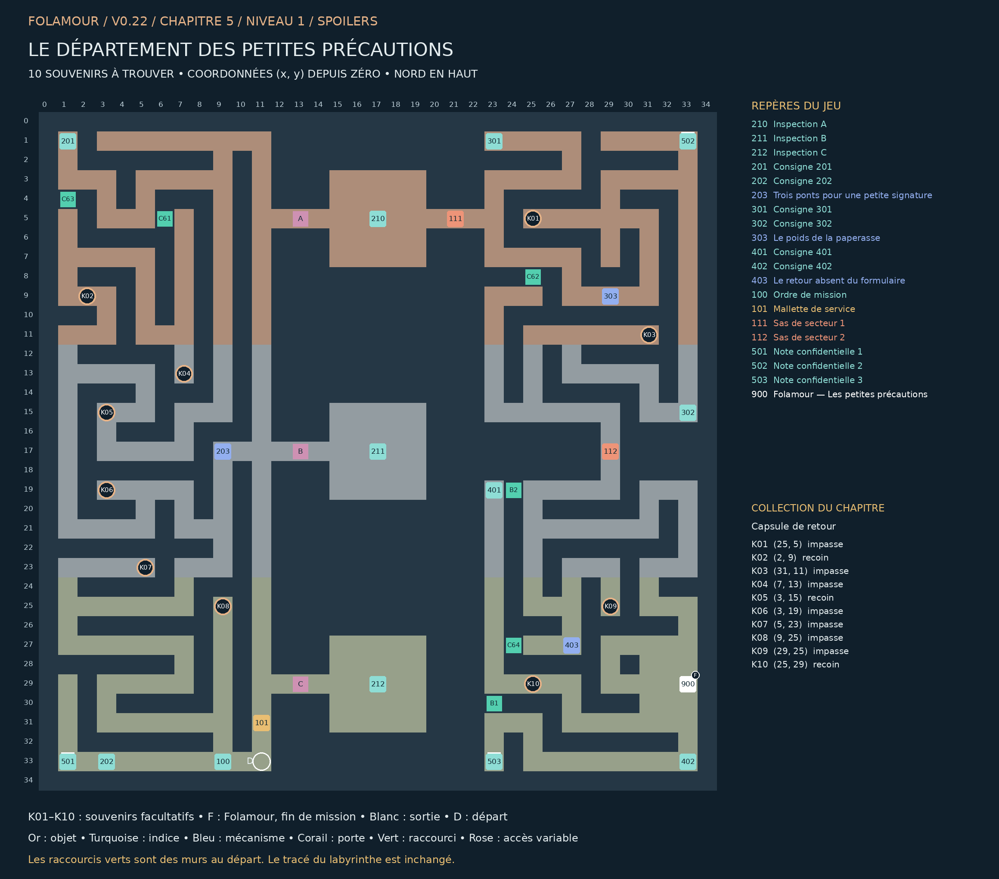

## Le département des petites précautions

### Chapitre 5 / Niveau 1 • Version 0.22 • Solutions complètes

HORIZON. Derrière les silhouettes aperçues au conseil, des fusées occupent des hangars entiers. PATIENCE. TENDRESSE. MODÉRATION. « Trois petites précautions. Nous avions prévu davantage de modération, mais le plafond était trop bas. » Le bon de fabrication porte le numéro de votre dernière validation.

Une épine de maintenance longe trois baies de silos. Les ponts A/B/C donnent accès aux inspections. Le sas 111 conduit à la comptabilité au nord-est, le sas 112 au retour des capsules au sud-est.

Cette édition remplace les anciennes cartes de ce niveau. Elle montre les nouveaux passages B1–B4, les portes existantes, les dix souvenirs K01–K10 et la position actuelle de Folamour. Les énigmes et les cases de base sont conservées.

### Collection et dossier

Collection : Capsule de retour. Ramasser les dix souvenirs est facultatif. Le dossier compte les trouvailles par niveau et par chapitre ; une archive se révèle à 10, 25 et 50 trouvailles dans ce chapitre. Rien ne doit être dépensé ou remis à Folamour.

Une collection n’apparaît sur la carte du jeu qu’après découverte de sa case. Son cercle disparaît après ramassage. Le présent guide dévoile tous les emplacements. Le clic ou toucher permet de s’y rendre et de ramasser ; le bouton Ramasser et la touche E fonctionnent aussi.

La collection suit la sauvegarde de cette aventure. Dans le dossier, rejouer un niveau terminé conserve la collection et les bilans, mais recommence ses énigmes et remplace le niveau en cours après confirmation. Une nouvelle aventure remet le dossier à zéro.

## Plan exact du labyrinthe

Pour lire les petits repères, utiliser le PNG en pleine résolution ou le PDF A3 séparé. Les coordonnées désignent les cases du labyrinthe ; le nord est en haut.

## Les dix souvenirs

Les fonds de branches vides sont privilégiés, en donnant priorité aux branches longues. Lorsqu’il manque d’impasses adaptées, les autres objets sont dans des recoins éloignés des interactions. Aucun mur n’a été déplacé.

| Repère | Case (x, y) | Situation | Distance minimale aux repères |
| --- | --- | --- | --- |
| K01 | (25, 5) | Fond d’impasse ; branche de 4 pas | 12 pas |
| K02 | (2, 9) | Recoin dans un couloir calme | 31 pas |
| K03 | (31, 11) | Fond d’impasse ; branche de 4 pas | 14 pas |
| K04 | (7, 13) | Fond d’impasse ; branche de 2 pas | 46 pas |
| K05 | (3, 15) | Recoin dans un couloir calme | 32 pas |
| K06 | (3, 19) | Fond d’impasse ; branche de 2 pas | 12 pas |
| K07 | (5, 23) | Fond d’impasse ; branche de 6 pas | 22 pas |
| K08 | (9, 25) | Fond d’impasse ; branche de 6 pas | 8 pas |
| K09 | (29, 25) | Fond d’impasse ; branche de 6 pas | 8 pas |
| K10 | (25, 29) | Recoin dans un couloir calme | 12 pas |

Longueur de branche : du fond à la première jonction. Distance aux repères : chemin le plus court jusqu’à un objet, une interaction, un départ ou un élément de décor réservé, sur la grille et sans raccourci. Deux souvenirs sont séparés d’au moins huit pas et de quatre cases en distance Manhattan.

## Parcours et fin de mission

### Ordre de visite de référence :

100 → 101 → 202 → 501 → 201 → 203 → 210 → 211 → 212 → 203 → 301 → 502 → 302 → 303 → 402 → 503 → 401 → 403 → 900

Cet ordre comprend les indices et secrets. Les manipulations des postes figurent ci-dessous. Les souvenirs peuvent être ramassés lors des détours, dès que leur secteur est accessible. Aucun raccourci ni souvenir n’est requis pour terminer.

### Fin : 900 — Folamour — Les petites précautions — (33, 29)

Parler au docteur et choisir « Faire le bilan avec Folamour ». Il remplace la dernière porte.

Validations requises : 203 — Trois ponts pour une petite signature, 303 — Le poids de la paperasse, 403 — Le retour absent du formulaire

Les dix souvenirs n’entrent jamais dans ces conditions.

## Énigmes et manipulations

### 203 — Trois ponts pour une petite signature

Installer la mallette. Trois crans par pont ; 0 ouvre le passage. I agit sur A+B, II sur B+C, III sur A+C. Aligner les trois, lire 210/211/212 et revenir valider. Départ : 1/2/0.

Piste : Lisez les deux consignes du secteur. Les règles complètes figurent aussi sur ce poste.

Méthode : Un cran après 2 revient à 0. Choisissez les mouvements par leurs effets communs ; une flèche inverse permet toujours de revenir.

Solution : II une fois, III deux fois : A/B/C = 0/0/0. Lire 210, 211, 212 puis revenir à 203 et valider.

Depuis la réinitialisation : II une fois, III deux fois : A/B/C = 0/0/0. Lire 210, 211, 212 puis revenir à 203 et valider.

Un cran après 2 revient à 0. Choisissez les mouvements par leurs effets communs ; une flèche inverse permet toujours de revenir.

### 303 — Le poids de la paperasse

Caisses indivisibles 1/2/3/4/6 ; capacités exactes P=5, T=5, M=6. La caisse 3 va à P ; 1 accompagne 4 ; 6 reste seule. Toutes les caisses doivent quitter le dépôt.

Piste : Lisez les deux consignes du secteur. Les règles complètes figurent aussi sur ce poste.

Méthode : Six remplit MODÉRATION. Le duo 1+4 remplit TENDRESSE ; 2 complète le dossier 3 dans PATIENCE.

Solution : 1 → TENDRESSE ; 2 → PATIENCE ; 3 → PATIENCE ; 4 → TENDRESSE ; 6 → MODÉRATION. Valider.

Depuis la réinitialisation : 1 → TENDRESSE ; 2 → PATIENCE ; 3 → PATIENCE ; 4 → TENDRESSE ; 6 → MODÉRATION. Valider.

Six remplit MODÉRATION. Le duo 1+4 remplit TENDRESSE ; 2 complète le dossier 3 dans PATIENCE.

### 403 — Le retour absent du formulaire

Capsule d’essai uniquement. Partir de D, visiter *, atteindre R sans jamais toucher X. Un mur bloque un pas. Maximum 18 ordres, puis tester et valider.

Piste : Lisez les deux consignes du secteur. Les règles complètes figurent aussi sur ce poste.

Méthode : Le passage haut est coupé. Descendez par la colonne 3 jusqu’au tampon, traversez à droite et remontez vers R.

Solution : E, E, S, S, E, E, N, N. Tester puis valider.

Depuis la réinitialisation : E, E, S, S, E, E, N, N. Tester puis valider.

Le passage haut est coupé. Descendez par la colonne 3 jusqu’au tampon, traversez à droite et remontez vers R.

### Plan de la capsule A (nord en haut)

| Ligne | Cases |
| --- | --- |
| 1 | D · . · . · # · R |
| 2 | # · # · . · # · . |
| 3 | . · . · . · * · . |
| 4 | . · # · # · # · . |
| 5 | . · . · . · . · X |

D : départ ; * : tampon ; R : retour ; X : interdit ; # : mur.

## Tous les repères et leurs conditions

### 210 — Inspection A — (17, 5)

PATIENCE : capacité de cinq caisses-unités. Le dossier de poids 3 lui est affecté. Aucun équipement réel ne figure sur ce manifeste : seulement des formulaires.

### 211 — Inspection B — (17, 17)

TENDRESSE : capacité cinq. La caisse de poids 1 accompagne celle de poids 4. Les caisses ne peuvent être divisées.

### 212 — Inspection C — (17, 29)

MODÉRATION : capacité six. Le dossier de poids 6 voyage seul. Le coût du formulaire dépasse celui de son contenu.

### 201 — Consigne 201 — (1, 1)

Les trois ponts tournent sur trois crans : 0 est aligné, 1 et 2 sont fermés. I déplace A et B ; II déplace B et C ; III déplace A et C. Les flèches inverses annulent un cran.

### 202 — Consigne 202 — (3, 33)

Départ A=1, B=2, C=0. Alignez les trois ponts, visitez les inspections 210/211/212, puis revenez certifier au poste 203. Les ponts ne se commandent qu’ici.

### 203 — Trois ponts pour une petite signature — (9, 17)

Installer la mallette. Trois crans par pont ; 0 ouvre le passage. I agit sur A+B, II sur B+C, III sur A+C. Aligner les trois, lire 210/211/212 et revenir valider. Départ : 1/2/0.

À installer / remettre : Mallette de service

Ouvre : 111

### 301 — Consigne 301 — (23, 1)

Répartir une fois chacune les caisses 1, 2, 3, 4 et 6 entre PATIENCE (5), TENDRESSE (5) et MODÉRATION (6). Aucun reste au dépôt.

### 302 — Consigne 302 — (33, 15)

Le relevé A affecte 3 à PATIENCE. Le relevé B groupe 1 avec 4. Le relevé C isole 6. Les capacités sont exactes.

### 303 — Le poids de la paperasse — (29, 9)

Caisses indivisibles 1/2/3/4/6 ; capacités exactes P=5, T=5, M=6. La caisse 3 va à P ; 1 accompagne 4 ; 6 reste seule. Toutes les caisses doivent quitter le dépôt.

À valider d’abord : 203 — Trois ponts pour une petite signature

Ouvre : 112

### 401 — Consigne 401 — (23, 19)

La capsule factice part de D. Elle doit passer par le tampon * puis rentrer en R. X est le conduit HORIZON : ne pas y entrer. Le plan reste toujours orienté nord en haut.

### 402 — Consigne 402 — (33, 33)

Programmez des pas N/E/S/O. Un mur bloque un pas. Tester montre la trace entière ; retirer le dernier ordre ou réinitialiser permet de tout corriger.

### 403 — Le retour absent du formulaire — (27, 27)

Capsule d’essai uniquement. Partir de D, visiter *, atteindre R sans jamais toucher X. Un mur bloque un pas. Maximum 18 ordres, puis tester et valider.

À valider d’abord : 303 — Le poids de la paperasse

### 100 — Ordre de mission — (9, 33)

Une épine de maintenance longe trois baies de silos. Les ponts A/B/C donnent accès aux inspections. Le sas 111 conduit à la comptabilité au nord-est, le sas 112 au retour des capsules au sud-est.

### 101 — Mallette de service — (11, 31)

À installer au premier poste 203. Le matériel reste en place après les essais.

### 111 — Sas de secteur 1 — (21, 5)

Commande depuis le poste 203.

Commande : 203

### 112 — Sas de secteur 2 — (29, 17)

Commande depuis le poste 303.

Commande : 303

### 501 — Note confidentielle 1 — (1, 33)

Notre capacité de modération a doublé. Veuillez applaudir modérément, mais deux fois.

Note secrète facultative. Elle est distincte de la collection K01–K10.

### 502 — Note confidentielle 2 — (33, 1)

Commande initiale : une cafetière. Avenant 486 : élargir légèrement la notion de pression.

Note secrète facultative. Elle est distincte de la collection K01–K10.

### 503 — Note confidentielle 3 — (23, 33)

Le formulaire RETOUR a été supprimé : il suggérait un manque de confiance dans le départ.

Note secrète facultative. Elle est distincte de la collection K01–K10.

### 900 — Folamour — Les petites précautions — (33, 29)

« Les trois validations des silos, puis votre rapport. Vous conviendrez que nos précautions sont restées tout à fait modestes à l’échelle astronomique. »

À valider d’abord : 203 — Trois ponts pour une petite signature, 303 — Le poids de la paperasse, 403 — Le retour absent du formulaire

## Raccourcis et reprise

| ID | Mur | Deux cases à visiter | Gain minimal |
| --- | --- | --- | --- |
| C61 | (6, 5) | (7, 5) / (5, 5) | 24 pas |
| C62 | (25, 8) | (25, 7) / (25, 9) | 56 pas |
| C63 | (1, 4) | (1, 3) / (1, 5) | 24 pas |
| C64 | (24, 27) | (25, 27) / (23, 27) | 20 pas |
| B1 | (23, 30) | (23, 29) / (23, 31) | 24 pas |
| B2 | (24, 19) | (25, 19) / (23, 19) | 20 pas |

Marcher sur les deux côtés du mur ouvre le raccourci. Voir les cases sur la carte ne suffit pas. Le gain minimal compare les deux côtés du mur : passage de 2 pas contre le détour restant lorsque les autres raccourcis et les verrous sont ouverts. Les sas à sens unique restent exclus. Chaque nouvelle porte économise au moins 20 pas ; les portes antérieures au moins 12.

### Nouvelles portes : retours utiles

B1 : de [503] Note confidentielle 3 vers [403] Le retour absent du formulaire. 34 pas sans cette porte ; 10 avec : 24 pas économisés.

B2 : de [401] Consigne 401 vers [303] Le poids de la paperasse. 52 pas sans cette porte ; 32 avec : 20 pas économisés.

Exemples mesurés avec la carte entièrement connue et les autres portes ouvertes. Ce sont des trajets de retour comparables, pas une estimation du temps d’une première partie. Le détour initial reste nécessaire pour visiter les deux côtés du mur.

Reprise de v0.21 : les anciennes portes et leur position sont conservées. Une nouvelle porte se révèle immédiatement si ses deux cases avaient déjà été parcourues. Les objets, énigmes et souvenirs restent acquis.

Le clic approche désormais assez près des commandes fixées au mur pour les examiner. Cliquer sur un objet inaccessible annule la destination précédente.

Carte : clic droit sur un passage découvert et accessible pour fermer la carte et marcher vers ce point. Zoom : molette ou boutons de zoom ; recul maximal augmenté. Dossier : bouton près de l’objectif, menu Pause ou bilan de fin.

Folamour réagit aux rencontres, découvertes, essais et réussites. Les options « Animations décoratives » et « Répliques de Folamour » sont séparées dans la pause. Désactiver les répliques n’efface pas les observations archivées.

Sauvegarde locale au navigateur et à l’appareil. Les anciennes sauvegardes v4 sont compatibles ; une collection déjà commencée est conservée. Les totaux des anciennes parties couvrent uniquement les informations qui ont été enregistrées. Aucun ancien souvenir n’est attribué automatiquement.
