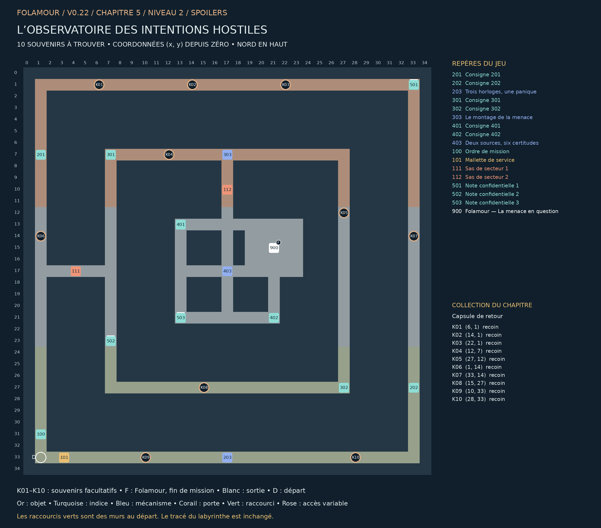

## L’observatoire des intentions hostiles

### Chapitre 5 / Niveau 2 • Version 0.22 • Solutions complètes

La carte du monde clignote de certitudes. Une fenêtre s’allume : hostilité. Une fenêtre s’éteint : dissimulation. « Absence de comportement suspect : préparation particulièrement réussie. » Les opérateurs ont quitté leurs fauteuils. Leurs rapports continuent d’arriver.

Trois enceintes imbriquées : relevés sur le grand circuit extérieur, chronologie sur l’anneau médian, boucle des sources au centre. Le passage ouest 111 puis le passage nord 112 donnent accès aux enceintes suivantes.

Cette édition remplace les anciennes cartes de ce niveau. Elle montre les nouveaux passages B1–B4, les portes existantes, les dix souvenirs K01–K10 et la position actuelle de Folamour. Les énigmes et les cases de base sont conservées.

### Collection et dossier

Collection : Capsule de retour. Ramasser les dix souvenirs est facultatif. Le dossier compte les trouvailles par niveau et par chapitre ; une archive se révèle à 10, 25 et 50 trouvailles dans ce chapitre. Rien ne doit être dépensé ou remis à Folamour.

Une collection n’apparaît sur la carte du jeu qu’après découverte de sa case. Son cercle disparaît après ramassage. Le présent guide dévoile tous les emplacements. Le clic ou toucher permet de s’y rendre et de ramasser ; le bouton Ramasser et la touche E fonctionnent aussi.

La collection suit la sauvegarde de cette aventure. Dans le dossier, rejouer un niveau terminé conserve la collection et les bilans, mais recommence ses énigmes et remplace le niveau en cours après confirmation. Une nouvelle aventure remet le dossier à zéro.

## Plan exact du labyrinthe

Pour lire les petits repères, utiliser le PNG en pleine résolution ou le PDF A3 séparé. Les coordonnées désignent les cases du labyrinthe ; le nord est en haut.

## Les dix souvenirs

Les fonds de branches vides sont privilégiés, en donnant priorité aux branches longues. Lorsqu’il manque d’impasses adaptées, les autres objets sont dans des recoins éloignés des interactions. Aucun mur n’a été déplacé.

| Repère | Case (x, y) | Situation | Distance minimale aux repères |
| --- | --- | --- | --- |
| K01 | (6, 1) | Recoin dans un couloir calme | 11 pas |
| K02 | (14, 1) | Recoin dans un couloir calme | 19 pas |
| K03 | (22, 1) | Recoin dans un couloir calme | 11 pas |
| K04 | (12, 7) | Recoin dans un couloir calme | 5 pas |
| K05 | (27, 12) | Recoin dans un couloir calme | 15 pas |
| K06 | (1, 14) | Recoin dans un couloir calme | 6 pas |
| K07 | (33, 14) | Recoin dans un couloir calme | 13 pas |
| K08 | (15, 27) | Recoin dans un couloir calme | 12 pas |
| K09 | (10, 33) | Recoin dans un couloir calme | 7 pas |
| K10 | (28, 33) | Recoin dans un couloir calme | 11 pas |

Longueur de branche : du fond à la première jonction. Distance aux repères : chemin le plus court jusqu’à un objet, une interaction, un départ ou un élément de décor réservé, sur la grille et sans raccourci. Deux souvenirs sont séparés d’au moins huit pas et de quatre cases en distance Manhattan.

## Parcours et fin de mission

### Ordre de visite de référence :

100 → 101 → 201 → 501 → 202 → 203 → 502 → 301 → 302 → 303 → 401 → 503 → 402 → 403 → 900

Cet ordre comprend les indices et secrets. Les manipulations des postes figurent ci-dessous. Les souvenirs peuvent être ramassés lors des détours, dès que leur secteur est accessible. Aucun raccourci ni souvenir n’est requis pour terminer.

### Fin : 900 — Folamour — La menace en question — (21, 15)

Parler au docteur et choisir « Discuter des preuves avec Folamour ». Il remplace la dernière porte.

Validations requises : 203 — Trois horloges, une panique, 303 — Le montage de la menace, 403 — Deux sources, six certitudes

Les dix souvenirs n’entrent jamais dans ces conditions.

## Énigmes et manipulations

### 203 — Trois horloges, une panique

Choisir les décalages (affiché − réel). B affiche 11:59 à 12:00 réelles. A est trois minutes devant B ; C une minute derrière A. Chaque décalage est entre −2 et +2.

Piste : Lisez les deux consignes du secteur. Les règles complètes figurent aussi sur ce poste.

Méthode : B vaut −1. Donc A vaut +2 et C vaut +1. Soustraire ces valeurs remet les rapports à la même heure.

Solution : A : +2 ; B : −1 ; C : +1. Valider.

Depuis la réinitialisation : A : +2 ; B : −1 ; C : +1. Valider.

B vaut −1. Donc A vaut +2 et C vaut +1. Soustraire ces valeurs remet les rapports à la même heure.

### 303 — Le montage de la menace

Reconstituer les cinq événements à leur heure réelle. A avance de 2 minutes, B retarde de 1, C avance de 1. Un exemplaire de chaque image ; tester puis valider.

Piste : Lisez les deux consignes du secteur. Les règles complètes figurent aussi sur ce poste.

Méthode : Les heures corrigées sont 12:00 cuisine, 12:01 prévision, 12:02 sirène, 12:03 volets, 12:04 confirmation.

Solution : Cuisine → prévision → sirène → volets → confirmation. Tester puis valider.

Depuis la réinitialisation : Cuisine → prévision → sirène → volets → confirmation. Tester puis valider.

Les heures corrigées sont 12:00 cuisine, 12:01 prévision, 12:02 sirène, 12:03 volets, 12:04 confirmation.

### 403 — Deux sources, six certitudes

Chaque flèche fournit une preuve au nœud suivant. Suspendre exactement deux copies pour rendre le graphe sans boucle. Conserver Capteur→A, Fenêtre→C, A→B, C→D. Tester le graphe avant validation.

Piste : Lisez les deux consignes du secteur. Les règles complètes figurent aussi sur ce poste.

Méthode : Chaque copie revient vers son propre ancêtre. Retirer B→A et D→C laisse les deux chaînes d’observation ouvertes.

Solution : Suspendre B → A et D → C uniquement. Tester puis valider.

Depuis la réinitialisation : Suspendre B → A et D → C uniquement. Tester puis valider.

Chaque copie revient vers son propre ancêtre. Retirer B→A et D→C laisse les deux chaînes d’observation ouvertes.

## Tous les repères et leurs conditions

### 201 — Consigne 201 — (1, 7)

Les horloges A/B/C ont un décalage constant entre −2 et +2 minutes. Heure réelle = heure affichée moins décalage. À 12:00 réelles, B indiquait 11:59.

### 202 — Consigne 202 — (33, 27)

Au même instant A affiche trois minutes de plus que B. C affiche une minute de moins que A. Les écarts portent sur les horloges, pas sur les événements.

### 203 — Trois horloges, une panique — (17, 33)

Choisir les décalages (affiché − réel). B affiche 11:59 à 12:00 réelles. A est trois minutes devant B ; C une minute derrière A. Chaque décalage est entre −2 et +2.

À installer / remettre : Mallette de service

Ouvre : 111

### 301 — Consigne 301 — (7, 7)

Images originales : cuisine allumée A 12:02 ; prévision MIROIR B 12:00 ; sirène C 12:03 ; volets fermés A 12:05 ; hostilité « confirmée » B 12:03.

### 302 — Consigne 302 — (27, 27)

Retirer les décalages A=+2, B=−1, C=+1. Classer les cinq images de la première à la dernière. Une confirmation postérieure ne peut pas être la cause de l’alerte initiale.

### 303 — Le montage de la menace — (17, 7)

Reconstituer les cinq événements à leur heure réelle. A avance de 2 minutes, B retarde de 1, C avance de 1. Un exemplaire de chaque image ; tester puis valider.

À valider d’abord : 203 — Trois horloges, une panique

Ouvre : 112

### 401 — Consigne 401 — (13, 13)

Les flèches signifient « sert de preuve à ». Capteur → A et Fenêtre → C sont les deux apports physiques à conserver. A → B et C → D sont les registres horodatés à conserver.

### 402 — Consigne 402 — (21, 21)

B → A et D → C sont des copies ajoutées après les rapports. Suspendre exactement deux liens, éliminer tout raisonnement circulaire, garder les quatre apports originaux.

### 403 — Deux sources, six certitudes — (17, 17)

Chaque flèche fournit une preuve au nœud suivant. Suspendre exactement deux copies pour rendre le graphe sans boucle. Conserver Capteur→A, Fenêtre→C, A→B, C→D. Tester le graphe avant validation.

À valider d’abord : 303 — Le montage de la menace

### 100 — Ordre de mission — (1, 31)

Trois enceintes imbriquées : relevés sur le grand circuit extérieur, chronologie sur l’anneau médian, boucle des sources au centre. Le passage ouest 111 puis le passage nord 112 donnent accès aux enceintes suivantes.

### 101 — Mallette de service — (3, 33)

À installer au premier poste 203. Le matériel reste en place après les essais.

### 111 — Sas de secteur 1 — (4, 17)

Commande depuis le poste 203.

Commande : 203

### 112 — Sas de secteur 2 — (17, 10)

Commande depuis le poste 303.

Commande : 303

### 501 — Note confidentielle 1 — (33, 1)

Le dernier opérateur a noté : « Je n’ai rien vu. » Sa précision lui a valu une formation corrective.

Note secrète facultative. Elle est distincte de la collection K01–K10.

### 502 — Note confidentielle 2 — (7, 23)

La radio cite le rapport qui cite la radio. Deux sources indépendantes, selon la radio.

Note secrète facultative. Elle est distincte de la collection K01–K10.

### 503 — Note confidentielle 3 — (13, 21)

Le dîner a été reclassé en offensive alimentaire. Le dessert fait encore débat.

Note secrète facultative. Elle est distincte de la collection K01–K10.

### 900 — Folamour — La menace en question — (21, 15)

« Une fois les trois analyses terminées, dites-moi d’où vient la menace. Et si toutes les preuves se citent entre elles, demandez qui a commencé. »

À valider d’abord : 203 — Trois horloges, une panique, 303 — Le montage de la menace, 403 — Deux sources, six certitudes

## Raccourcis et reprise

Ce niveau utilise des boucles naturelles et ne contient pas de raccourci caché.

Marcher sur les deux côtés du mur ouvre le raccourci. Voir les cases sur la carte ne suffit pas. Le gain minimal compare les deux côtés du mur : passage de 2 pas contre le détour restant lorsque les autres raccourcis et les verrous sont ouverts. Les sas à sens unique restent exclus. Chaque nouvelle porte économise au moins 20 pas ; les portes antérieures au moins 12.

Reprise de v0.21 : les anciennes portes et leur position sont conservées. Une nouvelle porte se révèle immédiatement si ses deux cases avaient déjà été parcourues. Les objets, énigmes et souvenirs restent acquis.

Le clic approche désormais assez près des commandes fixées au mur pour les examiner. Cliquer sur un objet inaccessible annule la destination précédente.

Carte : clic droit sur un passage découvert et accessible pour fermer la carte et marcher vers ce point. Zoom : molette ou boutons de zoom ; recul maximal augmenté. Dossier : bouton près de l’objectif, menu Pause ou bilan de fin.

Folamour réagit aux rencontres, découvertes, essais et réussites. Les options « Animations décoratives » et « Répliques de Folamour » sont séparées dans la pause. Désactiver les répliques n’efface pas les observations archivées.

Sauvegarde locale au navigateur et à l’appareil. Les anciennes sauvegardes v4 sont compatibles ; une collection déjà commencée est conservée. Les totaux des anciennes parties couvrent uniquement les informations qui ont été enregistrées. Aucun ancien souvenir n’est attribué automatiquement.
